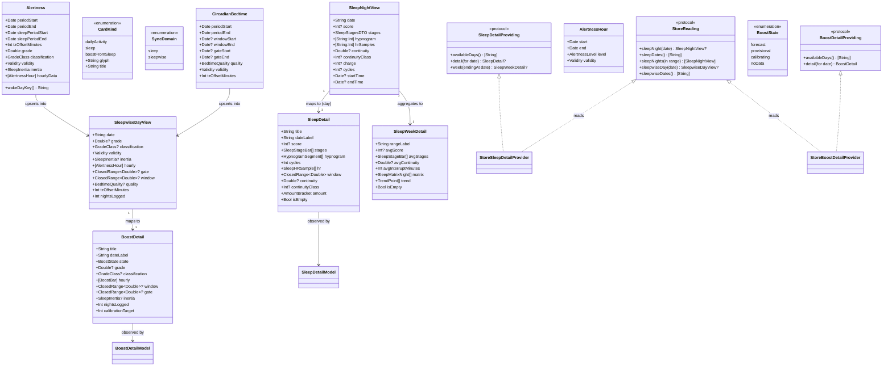

# Sleep Detail & Boost From Sleep Detail Screens (with dashboard wiring)

## Requirements

- **Build the Sleep Detail screen** (`.sleep` card, glyph "Z") with **both Day and Week views** (the design's DAY/WK toggle), rendered from the already-synced local `sleep_night` data — score, hypnogram·cycles, HR line, and the amount/solidity/regen metric breakdown for Day; sleep matrix, trend, and weekly consolidation for Week.
- **Build the Boost From Sleep screen** (`.boostFromSleep` card, glyph "B") as a **greenfield vertical slice (Epic 9 / SleepWise)** — Boost score /10 + classification, hourly boost bars, circadian gate/window, sleep inertia, and a distinct **calibrating** state before enough nights are logged.
- **Generalize the dashboard detail-navigation seam** so tapping any card routes to its own detail screen, replacing the `.dailyActivity`-hard-wired `hasDetail`/`detailModel`/`navigationDestination`. Wiring the SLEEP and BOOST placeholders to their features **is** the "clicking the icon takes us to the feature" deliverable.
- **Populate the SLEEP and BOOST dashboard card glances** (replace the current `.empty`) with real headline/detail summaries drawn from the store, mirroring the Daily Activity card.
- **Boundary:** local-first, **zero network on screen open** (sync stays on the dashboard's pull-to-refresh), **no spinners** (Norm 4), reuse the existing `Theme` instrument vocabulary. Interactive/authoring affordances ("RATE YOUR SLEEP", "ASK FOR FEEDBACK", "HOW IT WORKS") are **out of scope** — render static or omit. No reordering of the fixed `CardKind` feed order.
- **Value:** turns two dead dashboard placeholders into shipping instrument screens on the same clean vertical-slice template as Daily Activity, and converts the ad-hoc single-detail navigation into a scalable seam that makes the remaining detail screens trivial to add.

## Entities

## Approach

1. **Vertical-slice cloning (architecture strategy):**
   - Reproduce the Daily Activity slice shape exactly, twice: display model in `PolarProtocol` → store-backed provider in `PolarStore` (zero network) → `@MainActor @Observable` VM + SwiftUI view in `HerculesUI`, wired through the dashboard `NavigationStack`.
   - **Track A — Sleep Detail (UI-mostly):** the fetch/decode/sync/store of `sleep_night` already exists; work is a ranged reader + display model + provider + DAY/WK view + nav wiring.
   - **Track B — Boost From Sleep (full-stack greenfield):** land the data spine first — alertness + circadian models, `V3DataClient` fetches, a new `SyncDomain.sleepwise` + registry descriptor, store table/record/view/reader (+ GRDB migration) — *before* the UI is meaningful.
   - **Sequence:** Sleep Detail end-to-end (including the nav-seam refactor, done once) → Boost data spine → Boost UI. This ships a screen on validated data first and de-risks Boost's later wiring.

2. **Dashboard navigation seam (generalize once, up front):**
   - Refactor `hasDetail`/`detailModel`/`navigationDestination` from the `.dailyActivity`-only hard-wire into a `CardKind`-routed seam. Introduce a `DetailRoute` enum (`.activity(ActivityDetailModel)`, `.sleep(SleepDetailModel)`, `.boost(BoostDetailModel)`) that `DashboardModel.detailModel(for:)` returns, and a `@ViewBuilder` switch in `DashboardView.navigationDestination` producing the right bespoke view.
   - Keep the change **additive and test-covered**: verify Daily Activity still routes before adding Sleep; each new card is one enum case + one switch arm.
   - Rejected: a second `if kind == .sleep` branch (compounds coupling) and a single generic config-driven DetailView (fights the materially different visualizations). **Generalize routing, keep bespoke views.**

3. **Store reads (range query, provider-side aggregation):**
   - Add `sleepDates()` and a ranged `sleepNights(in range:)` to `StoreReading`, mirroring the existing `cardioLoad(in range:)` precedent — one query, not N single `sleepNight(date:)` round-trips — because the Week view aggregates 7 nights.
   - Keep all aggregation (week averages, matrix, trend, `"HH:MM"`-map normalization) **in the provider** (off the main-actor read), passing flat arrays to the view (activity precedent), so heavy 7-night materialization never touches the UI.

4. **SleepWise sync domain (dedicated, not folded into `.sleep`):**
   - Add `SyncDomain.sleepwise` and a `SyncRegistry` descriptor calling both `V3DataClient.fetchAlertness()` and `fetchCircadianBedtime()` → `store.upsertSleepwise(...)`. Consistent with the one-entry-per-metric registry principle; conflating two endpoints/failure-modes into `.sleep` is rejected.
   - **Policy = `.windowless`** (live capture 2026-07-01): each endpoint returns a **top-level array of ~28 night-entries in a single call** (like `.sleep`/`.cardioLoad`), *not* a per-date fetch — so **not** `.perDay`. The descriptor fetches both arrays once, zips them by wake-day key, and upserts each merged night.
   - **Join key:** entries carry **no `date` field**; derive the day from `sleep_period_end_time` (the wake morning) so an alertness night and its circadian night line up, and so "night" → dashboard "YESTERDAY · WED 23" is correct. Alertness and circadian arrays may differ in length (a night can have one but not the other) — merge per-key, degrade per-field.
   - `SyncDomain` is `CaseIterable` and feeds freshness (`max` over all domains) + `SyncReport`; the new case must be **additive** with no exhaustive switch breaking.

5. **Business logic (states, boundaries, calibration):**
   - **Empty/absent** nights (no server row): the provider yields an explicit empty representation (`SleepDetail.isEmpty` → "NO RECORD / NO TELEMETRY"; `BoostState.noData` → "NO DATA"), never a zeroed screen. `sleep/available` distinguishes "no data yet" from "not worn."
   - **Confidence vs. calibration — two distinct signals (resolved via live capture 2026-07-01):**
     - *Per-night confidence* is API-signaled: `validity ∈ {VALID, ESTIMATE}` on each alertness entry (and each hourly bucket). `ESTIMATE` = the night's forecast was **interpolated across a data gap** (verified: estimate entries cluster around missing nights), not a cold-start. Render an `ESTIMATE` night as `BoostState.provisional` (grade shown, dimmed/flagged), never hidden.
     - *Global calibration* (the fresh-user **"NIGHTS LOGGED NN / 14"** screen) is **not** carried in-band — a calibrated account simply returns full entries; a fresh account returns few/none. So gate `BoostState.calibrating` on a **logged-nights count** (`nightsLogged < calibrationTarget`, default 14). This is the residual fallback; it cannot be confirmed except against a fresh account.
   - **Grade is a `Double` 0–10** (e.g. `8.1`); classification (`GRADE_CLASSIFICATION_FAIR/WEAK/…`), inertia (`SLEEP_INERTIA_NO_INERTIA/MILD/MODERATE`), level (`ALERTNESS_LEVEL_HIGH/LOW/VERY_LOW/MINIMAL`), and quality (`CIRCADIAN_BEDTIME_QUALITY_*`) are **prefixed enum strings** — decode by stripping the prefix. `sleep_inertia` is an **enum, not minutes**.
   - **UTC-naive times + one authoritative offset:** all timestamps are **UTC** ISO with no zone; add `sleep_timezone_offset_minutes` to reach local wall-clock. Cross-checked against the design: alertness `sleep_period_start 21:23:12` / `end 04:42:12` **+330 = 02:53→10:12**, matching the analysis's stated sleep window (§ lines 51/97), and circadian `sleep_gate 20:50–21:20` **+330 ≈ 02:20**, matching "gate around 02:00". **The circadian endpoint reports a bogus offset of `0`** (its times are still UTC) — trusting it would place the gate/window **5.5 h early**. So take **one authoritative offset from the alertness entry** and apply it to *both* series; do not use circadian's own offset field.
   - **Hourly bars are an array with partial edge buckets:** `hourly_data` is `[{start_time, end_time, alertness_level, validity}]`, first/last spanning < 1h (e.g. `04:42:30→05:00:00`). Position bars by their own `start/end`, not by a fixed 24-bucket grid.
   - **Gate is a range:** circadian gives `sleep_gate_start_time`→`sleep_gate_end_time` (a window), plus `preferred_sleep_period_start/end_time` for the sleep window. Model the gate as `ClosedRange`, not a point.
   - **Night-anchored axis:** sleep spans midnight (e.g. 02:53→10:12), so anchor the hypnogram/HR axis on the **local wall-clock span of the plotted `"HH:MM"` keys themselves** (with midnight-wrap detection: if the key span > 12 h, morning keys `< 12` get `+24`), *not* a fixed 00:00 origin and *not* the `sleep_night` `start_time`/`end_time`. **Critical (bugfix 2026-07-01):** those datetimes are decoded as **UTC** while the hypnogram/HR maps are keyed by **local clock time** — anchoring the window on the UTC start/end (e.g. `21:15`) while the keys are local (`02:52`…`10:04`) pushes the data off the right edge and mislabels the header. Anchor window + hypnogram + HR through one shared `anchor` closure so they stay consistent; fall back to `start_time`/`end_time` only when there are no keys. Derive the SleepWise day from `sleep_period_end_time` to avoid off-by-one.
   - **Partial / gappy data:** degrade per-field (hypnogram present but `score` missing; alertness present but circadian absent); a 7-day window with gaps must average over present nights, not divide by 7 blindly. Empty `[:]` HR/hypnogram maps degrade the chart (mirror activity's HR curve degrading to the band alone).

6. **Visual reuse (design fidelity):**
   - Build hypnogram bands, HR line, and hourly boost bars from the same `Theme` tokens and the Swift-Charts/`GeometryReader`/`Path` idioms used in `ActivityHRChart`/`ActivityClockChart`. The consolidation wheel and hourly bars are custom viz — expect hand-rolled `GeometryReader`/`Path`, as `ActivityClockChart` already does.

7. **Error/degradation handling:** reads never throw to the UI — a failed store read degrades to the empty state (mirrors `StoreDashboardProvider`). Greenfield SleepWise decode/store path must be **probed against a live capture before the store schema is fixed** (echoing the project's "verify shapes live" discipline); the GRDB migration is additive/versioned and must not disturb existing rows.

## Structure

### Inheritance / Protocol Conformance
1. `SleepDetailProviding` protocol defines local-first day + week reads (`availableDays`, `detail(for:)`, `week(endingAt:)`); mirrors `ActivityDetailProviding`.
2. `StoreSleepDetailProvider` implements `SleepDetailProviding` over `any StoreReading` (zero network).
3. `StubSleepDetailProvider` implements `SleepDetailProviding` for previews / no-store fallback.
4. `BoostDetailProviding` protocol defines `availableDays` + non-optional `detail(for:)` (always returns a `BoostDetail`, whose `state` carries `.noData`/`.calibrating`); `StoreBoostDetailProvider` + `StubBoostDetailProvider` implement it.
5. `Alertness`, `CircadianBedtime` conform to `Decodable, Sendable, Equatable` (mirror `SleepNight`, tolerant `decodeIfPresent`).
6. `PolarDatabase` extends its `StoreReading`/`StoreWriting` conformances additively with the new sleep-range and sleepwise methods.
7. `SyncDomain` gains `.sleepwise`; `CardKind` routing gains `.sleep`/`.boostFromSleep` arms (both enums stay `CaseIterable`).

### Dependencies
1. `SleepDetailModel` depends on `SleepDetailProviding`; `BoostDetailModel` depends on `BoostDetailProviding` (injected, stub defaults).
2. `StoreSleepDetailProvider` / `StoreBoostDetailProvider` depend on `any StoreReading`.
3. `DashboardModel` injects `SleepDetailProviding` + `BoostDetailProviding` (alongside the existing `ActivityDetailProviding`) and builds the per-kind `DetailRoute`.
4. `DashboardView.navigationDestination` depends on `DashboardModel.detailModel(for:)` → renders `ActivityDetailView` / `SleepDetailView` / `BoostView` via a `@ViewBuilder` switch.
5. `SyncRegistry.standard` descriptor for `.sleepwise` depends on `clients.v3.fetchAlertness()` + `fetchCircadianBedtime()` and `store.upsertSleepwise(...)`.
6. `StoreDashboardProvider` depends on the store readers to build SLEEP/BOOST card glances.

### Layered Architecture
1. **Model layer (`PolarProtocol`):** `SleepDetail`, `SleepWeekDetail`, `BoostDetail`, `Alertness`, `CircadianBedtime`, the providing protocols + stubs, `SyncDomain.sleepwise`.
2. **Persistence layer (`PolarStore`):** `SleepwiseDayView`, `SleepwiseDayRecord` (+ GRDB migration), ranged sleep readers, `sleepwise` readers, `upsertSleepwise`, `StoreSleepDetailProvider`, `StoreBoostDetailProvider`, `SyncRegistry` descriptor, SLEEP/BOOST card formatters.
3. **Client layer (`PolarProtocol/V3`):** `V3DataClient.fetchAlertness()`, `fetchCircadianBedtime()`.
4. **View-model layer (`HerculesUI`):** `SleepDetailModel` (day list + swipe + DAY/WK mode), `BoostDetailModel`; `DashboardModel` seam generalization.
5. **View layer (`HerculesUI`):** `SleepDetailView` (+ week subviews: hypnogram, HR line, stage breakdown, sleep matrix, trend, consolidation wheel), `BoostView` (forecast / calibrating / no-data), `DashboardView` routing switch.

## Operations

### Create Display Model — `SleepDetail` + supporting value types (`PolarProtocol/Dashboard/SleepDetail.swift`)
1. Responsibility: flat, UI-visible day-view value type for the Sleep Detail screen (analogue of `ActivityDetail`); UI renders geometry/formatting from it without importing `PolarStore`.
2. Attributes:
   - `title: String` — "TODAY" for the current UTC night, else weekday.
   - `dateLabel: String` — "WED · 25 JUN" style.
   - `score: Int?`, `cycles: Int`, `continuity: Double?`, `continuityClass: Int?`.
   - `stages: [SleepStageBar]` — REM/LIGHT/DEEP/AWAKE minutes + ramp level, fixed order so the legend renders without branching.
   - `hypnogram: [HypnogramSegment]` — ordered segments `(startHour, endHour, stage)` derived from the `"HH:MM"`→stage map, anchored on the night window.
   - `hr: [SleepHRSample]` — `(hour: Double, bpm: Int)`, empty when HR absent (chart degrades).
   - `window: ClosedRange<Double>` — fractional-hour sleep window (may cross 24h; anchored on the **local-clock span of the hypnogram/HR keys**, not the UTC `startTime`/`endTime` — see Approach 5).
   - `amount: AmountBracket` — amount-vs-average bracket (below/on/above).
   - `isEmpty: Bool` — true when the night has no server row → "NO RECORD / NO TELEMETRY".
3. Methods: memberwise `init`; `static func empty(title:dateLabel:) -> SleepDetail`; `static func sample(...) -> SleepDetail` for stubs/previews.
4. Constraints: `Sendable, Equatable`; `stages` always full-length; `hypnogram`/`hr` sorted ascending by hour.

### Create Display Model — `SleepWeekDetail` (same file or `SleepWeekDetail.swift`)
1. Responsibility: week-view aggregate value type (7-night window).
2. Attributes: `rangeLabel: String`; `avgScore: Int?`; `avgStages: [SleepStageBar]`; `avgContinuity: Double?`; `avgInterruptMinutes: Int`; `matrix: [SleepMatrixNight]` (per-night stage bands for the SLEEP MATRIX, with RHYTHM/BOOST overlays gated on Track B); `trend: [TrendPoint]`; `isEmpty: Bool`.
3. Methods: memberwise `init`; `static func empty(...)`.
4. Constraints: aggregation computed over **present** nights only (never `/7` blindly); RHYTHM/BOOST overlay fields nullable until SleepWise data exists.

### Create Provider Protocol + Store Provider — `SleepDetailProviding` / `StoreSleepDetailProvider`
1. Interface Definition:
   - `func availableDays() async -> [String]` — sleep-night dates, most-recent first.
   - `func detail(for date: String) async -> SleepDetail?` — one night, `nil`/empty when absent.
   - `func week(endingAt date: String) async -> SleepWeekDetail?` — 7-night aggregate ending at `date`.
2. Core Methods (`StoreSleepDetailProvider`, over `any StoreReading`):
   - `availableDays`: `(try? store.sleepDates()) ?? []`.
   - `detail(for:)`: fetch `sleepNight(date:)`; if `nil` → `SleepDetail.empty(...)`; else normalize the `"HH:MM"` hypnogram + HR maps into ordered segments/samples anchored on the **local-clock span of those keys** (shared `anchor` closure, midnight-wrap aware — see Approach 5; the UTC `startTime`/`endTime` are a different clock and are used only as an empty-map fallback), derive stage bars from `stages`, compute the amount bracket, format title/dateLabel (UTC day, `en_US`, mirror `StoreActivityDetailProvider`'s date helpers).
   - `week(endingAt:)`: compute the 7-day `ClosedRange<String>` (UTC), call `sleepNights(in:)` **once**, aggregate averages/matrix/trend over present nights; empty range → `SleepWeekDetail.empty`.
   - Input Validation: parse dates via a fixed `en_US_POSIX` GMT `DateFormatter` (reuse the activity provider's helpers).
   - Exception Handling: reads never throw to the UI — `try?` → empty/`nil`.
3. Dependency Injection: `init(store: any StoreReading)`.
4. Also add `StubSleepDetailProvider` synthesising 7+ plausible nights (day + week swipe) for previews.

### Update `StoreReading` — ranged sleep readers (`StoreProtocols.swift` + `PolarDatabase+Reading.swift`)
1. Responsibility: expose list + range reads for sleep nights (only single-date `sleepNight(date:)` exists today).
2. Methods:
   - `func sleepDates() throws -> [String]` — `SELECT date FROM sleep_night ORDER BY date DESC`.
   - `func sleepNights(in range: ClosedRange<String>) throws -> [SleepNightView]` — filter `date` between bounds, `order(Column("date"))`, `.map { try $0.toView() }` (mirror `cardioLoad(in:)` exactly).
3. Constraints: additive to the protocol + conformance; run in `dbWriter.read {}`; absent → empty; **no schema change** for the sleep side.

### Create View-Model — `SleepDetailModel` (`HerculesUI/Detail/SleepDetailModel.swift`)
1. Responsibility: `@MainActor @Observable` VM; day list + swipe + DAY/WK mode. Mirrors `ActivityDetailModel`.
2. Attributes: `detail: SleepDetail?` (`private(set)`); `week: SleepWeekDetail?` (`private(set)`); `mode: ViewMode` (`.day`/`.week`); private `days: [String]`, `index`.
3. Methods:
   - `load()` — `days = await provider.availableDays()`, `index = 0`, refresh both day + week for the current date.
   - `showOlder()` / `showNewer()` — guarded index step + refresh; `canShowOlder`/`canShowNewer` (index 0 = most recent).
   - `setMode(_:)` — toggle DAY/WK.
   - private `refresh()` — `detail = await provider.detail(for: days[index])`; `week = await provider.week(endingAt: days[index])`.
4. Annotations: `@MainActor @Observable`; state `private(set)`.
5. Constraints: provider injected with a stub default; no spinner; reads instant.

### Create View — `SleepDetailView` (+ week subviews) (`HerculesUI/Detail/SleepDetailView.swift`)
1. Responsibility: SwiftUI Sleep Detail screen. Day: instrument header, score, hypnogram·cycles band, HR line, amount/solidity/regen breakdown. Week: sleep matrix (stages + RHYTHM/BOOST overlays), TREND toggle, weekly consolidation wheel + stage totals. DAY/WK toggle drives the subview.
2. Methods (private `@ViewBuilder`s): `header`, `hypnogramBand`, `hrLine`, `stageBreakdown`, `dayView`, `weekMatrix`, `trend`, `consolidationWheel`, `emptyState` ("NO RECORD / NO TELEMETRY" + SYNC BAND CTA).
3. Logic: local-first (opens instantly from `model`); count-up / bar-grow animation progress like `ActivityDetailView`; anchor hypnogram/HR on the night window; degrade gracefully on empty maps.
4. Constraints: reuse `Theme` tokens + `ActivityHRChart`/`ActivityClockChart` `GeometryReader`/`Path` idioms; no circular spinner (Norm 4).

### Create Wire Models + Enums — `Alertness` / `AlertnessHour` (`PolarProtocol/V3/SleepWiseModels.swift`)
> Shapes **verified against a live capture (2026-07-01)** — the endpoint returns a **top-level array of night-entries**, no `date` field, local ISO times + separate offset.
1. Responsibility: decode one element of `GET /v3/users/sleepwise/alertness/date` (`[Alertness]`) (HERC-090).
2. Attributes: `periodStart`/`periodEnd: Date` (from `period_start_time`/`period_end_time`); `sleepPeriodStart`/`sleepPeriodEnd: Date`; `tzOffsetMinutes: Int` (`sleep_timezone_offset_minutes`); `grade: Double`; `classification: GradeClass`; `validity: Validity`; `inertia: SleepInertia`; `hourlyData: [AlertnessHour]` where `AlertnessHour` = `(start: Date, end: Date, level: AlertnessLevel, validity: Validity)`.
3. Enums (prefix-stripping `Decodable`, tolerant `.unknown` default): `GradeClass` (`GRADE_CLASSIFICATION_FAIR/WEAK/GOOD/…`), `Validity` (`VALIDITY_VALID/ESTIMATE`), `SleepInertia` (`SLEEP_INERTIA_NO_INERTIA/MILD/MODERATE`), `AlertnessLevel` (`ALERTNESS_LEVEL_HIGH/LOW/VERY_LOW/MINIMAL`).
4. Methods: `wakeDayKey() -> String` — `YYYY-MM-DD` of `sleepPeriodEnd` (interpreted with `tzOffsetMinutes`); the join key + `sleepwise_day` PK.
5. Constructors: `init(from decoder:)`, tolerant `decodeIfPresent`, snake_case `CodingKeys` (mirror `SleepNight`). `grade` is a **`Double`, not `Int`**; `inertia` is an **enum, not minutes**.

### Create Wire Model — `CircadianBedtime` (same file)
1. Responsibility: decode one element of `GET /v3/users/sleepwise/circadian-bedtime/date` (`[CircadianBedtime]`) (HERC-091).
2. Attributes: `periodStart`/`periodEnd: Date`; `windowStart`/`windowEnd: Date?` (`preferred_sleep_period_start/end_time` — the sleep window); `gateStart`/`gateEnd: Date?` (`sleep_gate_start/end_time` — **the gate is a range, not a point**); `quality: BedtimeQuality` (`CIRCADIAN_BEDTIME_QUALITY_CLEARLY_RECOGNIZABLE/…` enum, **not a 1/3–3/3 number**); `validity: Validity`; `tzOffsetMinutes: Int`.
3. Constructors: tolerant `init(from decoder:)` + `CodingKeys`. `wakeDayKey()` derived from `periodEnd`/window for the join.
4. Note: this endpoint reports a **bogus `sleep_timezone_offset_minutes` of `0`** (capture 2026-07-01) while its timestamps are still UTC — **ignore it and use the matched alertness night's offset** when converting to local (verified: circadian gate `+330` ≈ 02:20 matches the design's "gate around 02:00"; using `0` places it 5.5 h early).

### Implement Client Fetches — `V3DataClient` (`PolarProtocol/V3/V3DataClient.swift`)
1. `func fetchAlertness() async throws -> [Alertness]` — `GET /users/sleepwise/alertness/date` → decode **top-level array**; empty ⇒ `[]` (mirror `fetchCardioLoad`, not the per-day activity path).
2. `func fetchCircadianBedtime() async throws -> [CircadianBedtime]` — `GET /users/sleepwise/circadian-bedtime/date` → decode top-level array; empty ⇒ `[]`.
3. Constraints: decode-only, no persistence/orchestration; no windowing/paging (the server returns the ~28-night set in one response); small payloads, no down-sampling.

### Create Store Record + View + Migration — `SleepwiseDayRecord` / `SleepwiseDayView`
1. Responsibility: persist each merged alertness + circadian night keyed by wake-day; rehydrate to a display-ready view.
2. Attributes (`sleepwise_day` table, PK `date` = wake-day key): `grade: Double?`, `classification: String?` (enum raw), `validity: String?`, `sleep_inertia: String?` (enum raw), `hourly_json: String` (the `[AlertnessHour]` array), `gate_start: Date?`, `gate_end: Date?`, `window_start: Date?`, `window_end: Date?`, `quality: String?` (enum raw), `tz_offset_minutes: Int?` — **stored from the alertness entry** (circadian's is unreliable); the single offset used to localize *all* of the night's UTC times.
3. Migration: **additive, versioned GRDB migration** creating `sleepwise_day`; must not disturb existing tables/rows.
4. `SleepwiseDayView`: decoded value type (`hourly` restored from `hourly_json`, enums restored, `gate`/`window` as `ClosedRange<Double>` fractional-hours anchored via `tz_offset_minutes`) returned by the reader.
5. Reader methods (`StoreReading`): `sleepwiseDay(date:) throws -> SleepwiseDayView?`, `sleepwiseDates() throws -> [String]`, and `sleepwiseNightsLogged() throws -> Int` (`SELECT count(*) FROM sleepwise_day`) for the calibration gate.
6. Writer method (`StoreWriting`): `upsertSleepwise(_ alertness: [Alertness], circadian: [CircadianBedtime])` — **zip the two arrays by `wakeDayKey()`**, upsert one merged row per night (a night present in only one array upserts its available fields). Persist the **alertness entry's `tzOffsetMinutes`** as the row's single offset and localize the circadian gate/window with it too (ignore circadian's own offset). Idempotent, empty input is a no-op success (Safeguard 7).

### Add Sync Domain — `SyncDomain.sleepwise` + registry descriptor
1. Responsibility: fetch both SleepWise arrays once and upsert the merged nights.
2. `SyncReport.swift`: add `case sleepwise` to `SyncDomain` (keep `CaseIterable`; confirm no exhaustive switch breaks freshness/report handling).
3. `SyncRegistry.standard`: add `SyncDomainDescriptor(domain: .sleepwise, priority: .p1, policy: .windowless)` (**resolved: windowless** — each endpoint returns the full night-set in one call, like `.sleep`) whose `action` calls `clients.v3.fetchAlertness()` + `fetchCircadianBedtime()` and `store.upsertSleepwise(alertness, circadian:)`.
4. Constraints: additive case; server-bounded set (~28 nights); a decode failure surfaces as the domain's `SyncOutcome.failure` without blocking other domains.

### Create Display Model + Provider — `BoostDetail` / `BoostDetailProviding` / `StoreBoostDetailProvider`
1. Responsibility: flat Boost display model + zero-network assembly from `sleepwise_day`.
2. `BoostDetail` attributes: `title`, `dateLabel`, `state: BoostState` (`.forecast`/`.provisional`/`.calibrating`/`.noData`), `grade: Double?`, `classification: GradeClass?`, `hourly: [BoostBar]` (bars positioned by their own `start`/`end`, partial edges included), `window: ClosedRange<Double>?`, `gate: ClosedRange<Double>?` (gate is a **range**), `inertia: SleepInertia?`, `nightsLogged: Int`, `calibrationTarget: Int` (default 14).
3. Provider logic (`StoreBoostDetailProvider`): `detail(for:)` state selection —
   - **`.noData`** when the row is absent.
   - **`.calibrating`** when `sleepwiseNightsLogged() < calibrationTarget` (the fresh-user 04/14 gate).
   - **`.provisional`** when the night's `validity == .estimate` (grade shown but flagged/dimmed — interpolated across a data gap).
   - **`.forecast`** otherwise, with `grade` (Double), classification, hourly bars, gate range, window.
   Anchor the hourly/gate/window axes on the row's single `tzOffsetMinutes` (the alertness offset, applied to all UTC times incl. the circadian gate/window); format the title from the wake-day (`sleep_period_end_time`) so "YESTERDAY · WED 23" is correct; degrade per-field on partial data (alertness-without-circadian ⇒ bars + grade but no gate/window, and vice-versa).
4. Also add `StubBoostDetailProvider` covering all three states for previews.

### Create View-Model + View — `BoostDetailModel` / `BoostView`
1. `BoostDetailModel`: `@MainActor @Observable`, day list + swipe, `detail: BoostDetail` (`private(set)`), provider injected with stub default; `load`/`showOlder`/`showNewer`.
2. `BoostView`: SwiftUI screen rendering the three states — forecast (score /10, classification, hourly boost bars, gate/window, inertia, duration, 28-day avg), calibrating ("NIGHTS LOGGED NN / 14"), no-data ("NO DATA" + SYNC BAND / HOW-IT-WORKS static). Reuse `Theme`; custom `GeometryReader`/`Path` bars + wheel; no spinner.

### Generalize Dashboard Navigation Seam — `DashboardModel` + `DashboardView`
1. `DashboardModel`:
   - Inject `sleepDetail: any SleepDetailProviding` and `boostDetail: any BoostDetailProviding` (stub defaults) alongside `activityDetail`.
   - Introduce `enum DetailRoute { case activity(ActivityDetailModel), sleep(SleepDetailModel), boost(BoostDetailModel) }`.
   - `hasDetail(for:) -> Bool`: `true` for `.dailyActivity`, `.sleep`, `.boostFromSleep`.
   - `detailModel(for:) -> DetailRoute?`: switch on `CardKind` returning the built route (`nil` for cards without a detail screen yet).
2. `DashboardView.navigationDestination(for: CardKind.self)`: `@ViewBuilder` switch on `model.detailModel(for: kind)` → `ActivityDetailView` / `SleepDetailView` / `BoostView`.
3. Constraints: keep additive and covered by existing dashboard tests; **verify Daily Activity still routes** before adding Sleep/Boost.

### Populate Dashboard Card Glances — `StoreDashboardProvider` (SLEEP + BOOST)
1. Responsibility: replace the `.empty` SLEEP/BOOST cards with real glances (mirror `ActivityCardFormat`).
2. `SleepCardFormat.card(from: SleepNightView?)`: headline = "NN SCORE" (or sleep-duration), detail = "Xh Ym · CONTINUITY N/3"; absent → `.empty`.
3. `BoostCardFormat.card(from: SleepwiseDayView?, nightsLogged:)`: headline = "N/10 BOOST" (`.populated`); `.calibrating` glance below threshold; absent → `.noData`/`.empty`.
4. Constraints: fixed `en_US` locale; reads never throw (degrade to empty).

## Norms

1. **Display models live in `PolarProtocol`** (flat, `Sendable, Equatable` value types) so `HerculesUI` renders without importing `PolarStore` — mirror `ActivityDetail`/`DashboardSnapshot`.
2. **Provider pattern:** one `…Providing` protocol per detail screen + a `Store…Provider` (over `any StoreReading`, zero network) + a `Stub…Provider` (previews / no-store fallback). Reads use `try?` and never throw to the UI.
3. **View-models:** `@MainActor @Observable final class`, seam protocol injected via `init` with a stub default, state `private(set)`, no SwiftUI import; day-swipe list held most-recent-first with an `index` (index 0 = newest). Mirror `ActivityDetailModel`.
4. **No spinners:** local-first reads render instantly; sync only via dashboard pull-to-refresh; use the instrument idiom (count-up numbers, bars drawing in), never a circular spinner (Norm 4).
5. **Theme + chart idioms:** all geometry from `Theme` tokens (`mono`, `accent`, `zoneRamp`, `card`, `hairline`); reuse `ActivityHRChart`/`ActivityClockChart` `GeometryReader`/`Path` patterns for custom viz.
6. **Wire models:** `Decodable, Sendable, Equatable`, tolerant `decodeIfPresent`, explicit snake_case `CodingKeys`, `[:]`/`nil`/`[]` defaults — mirror `SleepNight`.
7. **Store additions are additive:** new `StoreReading`/`StoreWriting` methods run in `dbWriter.read {}`/`write {}`; ranged reads mirror `cardioLoad(in:)`; the `sleepwise_day` table is a versioned, additive GRDB migration.
8. **Sync registry is the single config site:** window/priority/cap for `.sleepwise` written as literals in `SyncRegistry.standard`; per-day 404 tolerated like the activity descriptor.
9. **UTC day handling:** parse/format the day key/date labels with a fixed `en_US_POSIX` GMT `DateFormatter` (reuse `StoreActivityDetailProvider` helpers); anchor the **intra-night** hypnogram/HR axis on the local-clock span of the `"HH:MM"` keys (midnight-wrap aware), **not** on the UTC `start_time`/`end_time` (different clock — see Approach 5) and not on 00:00.
10. **Documentation:** each new type carries a doc comment stating its layer, its analogue in the activity slice, and any design-file reference (`Sleep Detail.dc.html` / `Boost From Sleep.dc.html`), matching the house style.

## Safeguards

1. **Functional — Sleep Detail Day:** reproduces the design from local `sleep_night` (score, hypnogram·cycles, HR line, amount/solidity/regen); renders with **zero network** and no live sync on open.
2. **Functional — Sleep Detail Week:** aggregates a 7-night window via a **single** `sleepNights(in:)` read; averages/trend/matrix computed over **present nights only** (never `/7` blindly); RHYTHM/BOOST overlays render only when SleepWise (Track B) data exists, else degrade honestly.
3. **Functional — empty/absent states:** un-worn nights render "NO RECORD / NO TELEMETRY" (Sleep) and `BoostState.noData` "NO DATA" (Boost) — never a zeroed screen; `sleep/available` distinguishes "no data yet" from "not worn."
4. **Functional — Boost calibrating & confidence (two signals, verified live 2026-07-01):** below the logged-nights threshold the screen renders CALIBRATING with a "NIGHTS LOGGED NN / 14" counter, never a bogus 0/10 forecast (the pre-calibration gate is a nights-logged count — the API carries no in-band 04/14 marker). A night whose `validity == ESTIMATE` renders as **provisional** (grade shown, flagged) rather than as a full forecast or hidden — `ESTIMATE` means interpolated across a data gap.
5. **Functional — navigation:** tapping the SLEEP card opens Sleep Detail and the BOOST card opens Boost From Sleep; Daily Activity **continues to route unchanged** (verified before the seam change ships).
6. **Performance:** week-view materialization of 7 nights (with `"HH:MM"` maps) stays in the provider off the main-actor read; the view receives flat arrays; a single ranged query, not 7 round-trips.
7. **Data integrity:** `sleepwise_day` migration is additive/versioned and must not disturb existing rows; upserts are idempotent and empty input is a no-op success.
8. **Exception handling:** store reads never throw to the UI (degrade to empty/`nil`); per-day SleepWise fetch failures (incl. 404) don't fail the whole domain or block its sync anchor; failure messages carry no tokens/raw payloads.
9. **Integration — SyncDomain:** adding `.sleepwise` keeps `SyncDomain` `CaseIterable`, ripples correctly into `freshness()` (`max` over domains) and `SyncReport` with **no exhaustive switch breaking**; `CardKind` feed order and count are unchanged.
10. **Technical — greenfield verification (DONE 2026-07-01):** SleepWise shapes are pinned from a live capture — both endpoints return a **top-level array of ~28 night-entries** (windowless), **no `date` field** (key on `sleep_period_end_time`), `grade` is a **`Double`**, classification/inertia/quality/level/validity are **prefixed enum strings**, `sleep_inertia` is an **enum not minutes**, `hourly_data` is an **array with partial edge buckets**, the gate is a **range**, times are **local ISO + separate `sleep_timezone_offset_minutes`** (which can differ between the two endpoints for the same night). The `sleepwise_day` schema/decoders follow this capture, not `ARCHITECTURE.md`. **Residual:** the fresh-account pre-calibration payload (04/14) is unconfirmed — verify against a new account before shipping that state.
11. **Edge cases:** night-spanning-midnight axis anchored on the local-clock span of the hypnogram/HR keys (midnight-wrap aware), **not** the UTC `start_time`/`end_time` (bugfix 2026-07-01 — UTC datetimes vs local `"HH:MM"` keys bunched the chart to the right); "night"→dashboard-day label avoids off-by-one; partial data (missing `score`, alertness-without-circadian, week gaps, empty HR/hypnogram maps) degrades per-field.
12. **Scope boundary:** interactive/authoring affordances ("RATE YOUR SLEEP", "ASK FOR FEEDBACK", "HOW IT WORKS") are static or omitted (no backend); tapping the **whole card** navigates (matching Daily Activity's `NavigationLink`), not a separate icon hit-target.
