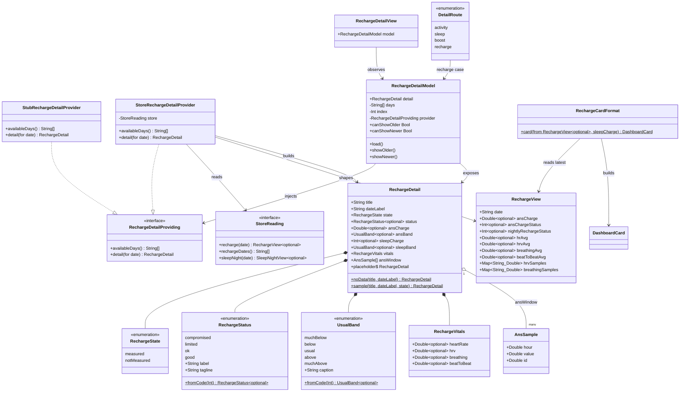

# Nightly Recharge Detail Screen + Dashboard Card Linking

## Requirements

Implement the **Nightly Recharge detail screen** as a navigable presentation layer over the already-built recharge data pipeline, and **link it from the dashboard** so tapping the `NIGHTLY RECHARGE` card pushes it — mirroring the existing Sleep Detail and Boost From Sleep vertical slices.

- **Reveal recovery at a glance**: surface the night's recharge status, signed ANS charge, sleep charge, and the four overnight vitals (HR, HRV, breathing rate, beat-to-beat) from local storage, instantly (local-first, no spinner).
- **Explain the ANS signal**: render a −10…+10 ANS-charge gauge and a 4-hour HRV window chart built from the stored time-keyed samples.
- **Never fabricate**: when the band wasn't worn, show a first-class "NOT MEASURED" state rather than a zeroed reading.
- **Stay navigable**: swipe/step across the ~28-day recharge window, most-recent-first.
- **Boundary**: no new networking, no schema/migration changes, no new sync domain — the `.recharge` domain already fetches, syncs, persists, and reads. This slice adds only presentation types, one `StoreReading` accessor for the date list, and the routing enrolment.

## Entities

**Conservative notes** (respect existing implementations):
- **No changes** to `NightlyRecharge`, `RechargeRecord`, `upsertRecharge`, `recharge(date:)`, `RechargeView`, `SyncRegistry`, or any migration. The wire→store→read pipeline is complete and stays untouched.
- `CardKind.nightlyRecharge` already exists (glyph `"R"`, title `"NIGHTLY RECHARGE"`) — **do not modify** the enum.
- `DashboardCard` gains **no per-domain fields**; the card glance rides on the existing `headline`/`detail` strings (mirrors `BoostCardFormat`).
- **Sleep charge is sourced, not fabricated**: read `SleepNightView.charge` (already stored, `Views.swift:33`) for the same date; when absent, the sleep-charge row degrades to no-data.
- New display types live in `PolarProtocol` (so `HerculesUI` renders without importing the store), exactly like `BoostDetail`/`SleepDetail`.

## Approach

1. **Presentation slice (mirror Boost/Sleep):**
   - Add a flat `RechargeDetail` display model in `PolarProtocol/Dashboard/`, carrying a `RechargeState` render enum and static `noData`/`placeholder`/`sample` factories — the exact shape/idiom of `BoostDetail`.
   - Add `RechargeDetailProviding` + `StubRechargeDetailProvider` (synthetic data) for previews and the no-store fallback.
   - The provider **always returns a value, never `nil`** — the empty case is carried in `RechargeDetail.state = .notMeasured`.

2. **Store-backed assembly (`PolarStore/Dashboard/StoreRechargeDetailProvider`):**
   - `StoreReading`-backed, zero network, non-throwing (`try?` → degrade to no-data).
   - `availableDays()` → new `store.rechargeDates()`; `detail(for:)` → shape `store.recharge(date:)`, cross-reading `store.sleepNight(date:)?.charge` for the sleep-charge value.
   - Select `state`: a present row → `.measured`; a missing row → `.notMeasured`.
   - Build the ANS window chart from `RechargeView.hrvSamples` (`"HH:MM"` **local** clock keys → fractional hours; anchor on the keys, not decoded datetimes).
   - **Status classification lives here / in the display layer**, not in storage: map raw `nightlyRechargeStatus` → `RechargeStatus`, `ansChargeStatus` → `UsualBand`, sleep-charge comparison → `UsualBand`. Unknown/out-of-range codes → `nil` (neutral label), never a crash.

3. **View-model + screen (`HerculesUI/Detail/`):**
   - `@MainActor @Observable RechargeDetailModel` — `detail` `private(set)`, most-recent-first `days`/`index`, `load()`/`showOlder()`/`showNewer()`, `canShowOlder`/`canShowNewer` (identical ergonomics to `BoostDetailModel`).
   - `RechargeDetailView` (SwiftUI) — the store's read type is already named `RechargeView`, so the screen **must** be `RechargeDetailView` to avoid a collision. Composes the design frames: recharge-status hero (charge bars + status label + tagline), ANS-charge gauge (−10…+10, zero tick, `UsualBand` caption), sleep-charge row (0–100 with usual marker), a 2×2 vitals grid, and the ANS 4-hour window chart. `.notMeasured` renders the "TELEMETRY UNAVAILABLE / SYNC BAND" frame. Back button + swipe gestures mirror `BoostView`.

4. **Dashboard linking (the routing seam — three touchpoints, mirroring Boost):**
   - `DashboardModel`: add `.recharge(RechargeDetailModel)` to `DetailRoute`; add `.nightlyRecharge` to `hasDetail(for:)` and `detailModel(for:)`; inject a `rechargeDetail: any RechargeDetailProviding` (stub default).
   - `DashboardView.navigationDestination`: add `case .recharge(let d): RechargeDetailView(model: d)`.
   - `HerculesApp.init`: inject `StoreRechargeDetailProvider(store: store)` into the connected `DashboardModel`.

5. **Card glance (`RechargeCardFormat`):**
   - Populate the `NIGHTLY RECHARGE` card from the latest recharge row (status label as headline, ANS charge as detail); degrade to `.empty` when no row exists. Wire into `StoreDashboardProvider.snapshot()` replacing the `default` fall-through for `.nightlyRecharge`.

6. **Error/edge strategy (Swift-idiomatic, not exception-driven):** there is no `GlobalExceptionHandler` here — reads are **non-throwing at the UI boundary**. Every store read uses `try?` and degrades to the designed no-data state (Norm 5). Each sub-element (ANS, sleep charge, chart, each vital) degrades independently so a partial night still renders what it has.

## Structure

### Conformance / Type Relationships
1. `RechargeDetailProviding` protocol defines the local-first read seam (`availableDays()`, `detail(for:)`), `Sendable`.
2. `StubRechargeDetailProvider` conforms to `RechargeDetailProviding` (synthetic data; the `PolarProtocol` default).
3. `StoreRechargeDetailProvider` conforms to `RechargeDetailProviding`, backed by `any StoreReading`.
4. `RechargeDetail`, `RechargeState`, `RechargeStatus`, `UsualBand`, `RechargeVitals`, `AnsSample` are `Sendable, Equatable` value types in `PolarProtocol`.
5. `RechargeDetailModel` is `@MainActor @Observable`, provider injected via initializer (stub default).
6. `DashboardModel.DetailRoute` gains a `.recharge(RechargeDetailModel)` case.
7. `PolarDatabase` gains a `rechargeDates()` method satisfying the extended `StoreReading` protocol (additive, no schema change — Safeguard 9).

### Dependencies
1. `RechargeDetailView` observes `RechargeDetailModel`.
2. `RechargeDetailModel` injects `any RechargeDetailProviding`.
3. `StoreRechargeDetailProvider` depends on `any StoreReading` (calls `rechargeDates()`, `recharge(date:)`, `sleepNight(date:)`).
4. `DashboardModel` injects `any RechargeDetailProviding` (5th detail provider) and builds the `.recharge` route on demand.
5. `DashboardView` switches over `DashboardModel.DetailRoute` in `navigationDestination`.
6. `HerculesApp` (composition root) constructs `StoreRechargeDetailProvider(store:)` and injects it.
7. `RechargeCardFormat` reads the latest `RechargeView` (+ sleep charge) and produces a `DashboardCard`; `StoreDashboardProvider` calls it.

### Layered Architecture
1. **Wire/Store layer** (`PolarProtocol/V3`, `PolarStore/Store`, `PolarStore/Records`): unchanged — `NightlyRecharge`, `RechargeRecord`, `RechargeView`, `recharge(date:)`. Only additive: `rechargeDates()` reader.
2. **Provider layer** (`PolarStore/Dashboard`): `StoreRechargeDetailProvider` (detail assembly + status mapping), `RechargeCardFormat` (glance).
3. **Display-model layer** (`PolarProtocol/Dashboard`): `RechargeDetail` + enums + `RechargeDetailProviding`/`StubRechargeDetailProvider`.
4. **View-model layer** (`HerculesUI/Detail`): `RechargeDetailModel`.
5. **View layer** (`HerculesUI/Detail`, `HerculesUI/Dashboard`): `RechargeDetailView`; `DashboardView` navigation branch.
6. **Composition root** (`App/HerculesApp.swift`): provider injection.
7. **Degradation policy** (replaces "exception handling layer"): non-throwing reads → designed no-data states; no error surfaces to the UI (Norm 5).

## Operations

### Create Display Model — `RechargeDetail` (`Packages/Sources/PolarProtocol/Dashboard/RechargeDetail.swift`)
1. Responsibility: flat, UI-visible value type for the Recharge screen; assembled by a provider, rendered by `HerculesUI` without importing the store.
2. Attributes:
   - `title: String` — `"TODAY"`/`"YESTERDAY"`/weekday.
   - `dateLabel: String` — `"SAT · 20 JUN"` style.
   - `state: RechargeState` — `.measured` / `.notMeasured`.
   - `status: RechargeStatus?` — nightly-recharge classification (nil when code unknown/absent).
   - `ansCharge: Double?` — signed, −10…+10.
   - `ansBand: UsualBand?` — ANS "usual" comparison.
   - `sleepCharge: Int?` — 0…100 (from the sleep row's `charge`).
   - `sleepBand: UsualBand?` — sleep-charge "usual" comparison.
   - `vitals: RechargeVitals` — HR / HRV / breathing / beat-to-beat averages.
   - `ansWindow: [AnsSample]` — HRV samples positioned on a fractional-hour axis (empty when none).
3. Methods / factories:
   - `static func noData(title:dateLabel:) -> RechargeDetail` — `.notMeasured`, all metrics `nil`/empty, `vitals` all-nil (mirror `BoostDetail.noData`).
   - `static let placeholder` — `noData(title: "RECHARGE", dateLabel: "")` for the VM's pre-load state.
   - `static func sample(title:dateLabel:state:) -> RechargeDetail` — representative measured night matching the design (ans `4.7`, sleep `53`, hr `71`, hrv `27`, breathing `14.3`, beat-to-beat `841`, a plausible HRV window 3:13→11:05).
4. Constraints: `Sendable, Equatable`; provider never returns `nil` — absence is `state = .notMeasured`.

### Create Enums — `RechargeState`, `RechargeStatus`, `UsualBand` (same file or adjacent)
1. `RechargeState`: `measured`, `notMeasured` — `Sendable, Equatable`.
2. `RechargeStatus`: cases `compromised`, `limited`, `ok`, `good`; `var label: String` (e.g. `"COMPROMISED"`), `var tagline: String` (e.g. `"ANS rebounded, but short sleep held the charge back."`); `static func fromCode(_ code: Int) -> RechargeStatus?` isolating the integer→case map (returns `nil` for unknown codes).
3. `UsualBand`: cases `muchBelow`, `below`, `usual`, `above`, `muchAbove`; `var caption: String` (`"MUCH BELOW USUAL"`, `"BELOW USUAL"`, `"AROUND USUAL"`, `"ABOVE USUAL"`, `"MUCH ABOVE USUAL"`); `static func fromCode(_ code: Int) -> UsualBand?`.
4. Constraint: **the code→case tables are the one unverified mapping** — isolate them in `fromCode` and mark with a `// TODO: verify codes against live capture` comment referencing the risk (do not block on it; unknown → `nil` → neutral render).

### Create Value Types — `RechargeVitals`, `AnsSample`
1. `RechargeVitals`: `heartRate: Double?`, `hrv: Double?`, `breathing: Double?`, `beatToBeat: Double?` — `Sendable, Equatable`.
2. `AnsSample`: `hour: Double` (fractional local hour), `value: Double`; `Identifiable` via `id: Double { hour }`; `Sendable, Equatable`.

### Create Protocol + Stub — `RechargeDetailProviding` / `StubRechargeDetailProvider` (`PolarProtocol/Dashboard/RechargeDetail.swift`)
1. Protocol (mirror `BoostDetailProviding`): `Sendable`; `func availableDays() async -> [String]` (most-recent first, empty when none); `func detail(for date: String) async -> RechargeDetail` (always a value).
2. `StubRechargeDetailProvider`: fixed sample dates; `detail(for:)` returns a mix of `.measured` sample nights and one `.notMeasured` so previews render every state.

### Add Store Reader — `rechargeDates()` (`PolarStore`)
1. Extend `StoreReading` (`Store/StoreProtocols.swift`): `func rechargeDates() throws -> [String]` with a doc comment mirroring `sleepwiseDates()`/`sleepDates()` ("all `recharge` dates (`YYYY-MM-DD`), most-recent first; backs the Recharge Detail day-swipe").
2. Implement on `PolarDatabase` (`Store/PolarDatabase+Reading.swift`): `dbWriter.read { db in try RechargeRecord.select(Column("date"), as: String.self).order(Column("date").desc).fetchAll(db) }` (follow the exact idiom used by `sleepwiseDates()`/`sleepDates()`; verify the existing implementation before copying).
3. Constraint: additive only — no migration, no write-path change.

### Implement Provider — `StoreRechargeDetailProvider` (`Packages/Sources/PolarStore/Dashboard/StoreRechargeDetailProvider.swift`)
1. Interface: conforms to `RechargeDetailProviding`; `init(store: any StoreReading)`.
2. `availableDays() async -> [String]`: `(try? store.rechargeDates()) ?? []`.
3. `detail(for date: String) async -> RechargeDetail`:
   - Compute `title`/`dateLabel` via GMT-anchored formatters (reuse the helper pattern from `StoreBoostDetailProvider`).
   - `guard let row = (try? store.recharge(date: date)) ?? nil else { return .noData(title:dateLabel:) }`.
   - `state = .measured`.
   - `status = row.nightlyRechargeStatus.flatMap(RechargeStatus.fromCode)`.
   - `ansCharge = row.ansCharge`; `ansBand = row.ansChargeStatus.flatMap(UsualBand.fromCode)`.
   - `sleepCharge = (try? store.sleepNight(date: date))??.charge`; `sleepBand` = classify sleepCharge vs. a baseline "usual" (see baseline op) or `nil` when absent.
   - `vitals = RechargeVitals(heartRate: row.hrAvg, hrv: row.hrvAvg, breathing: row.breathingAvg, beatToBeat: row.beatToBeatAvg)`.
   - `ansWindow = row.hrvSamples.map { AnsSample(hour: localHour(fromKey: $0.key), value: $0.value) }.sorted { $0.hour < $1.hour }` — parse `"HH:MM"` local keys to fractional hours (no timezone math; the key **is** the local clock).
   - Return the assembled `RechargeDetail`.
4. Helpers: `localHour(fromKey:)` (`"HH:MM"` → `Double`), plus the title/dateLabel formatters copied from `StoreBoostDetailProvider`.
5. Constraints: zero network (Safeguard 3), non-throwing (all reads `try?`), never returns `nil`.

### Implement Baseline (28-day "usual") — inside `StoreRechargeDetailProvider`
1. Responsibility: derive the ANS/sleep "usual" band at read-time (not stored).
2. Logic: optionally load the recent recharge window to compute a personal mean; classify the night's value into `UsualBand` by standard-deviation/threshold bands. **Sparse-data guard**: below a minimum night count (e.g. < 7), return `nil` band (render the value without a "usual" caption) rather than an unreliable comparison.
3. Constraint: read-time only; if this exceeds slice scope, ship with `fromCode`-derived bands (the raw `ansChargeStatus`) and defer the computed baseline — note the decision inline.

### Implement View-Model — `RechargeDetailModel` (`Packages/Sources/HerculesUI/Detail/RechargeDetailModel.swift`)
1. `@MainActor @Observable public final class RechargeDetailModel`.
2. Attributes: `public private(set) var detail: RechargeDetail = .placeholder`; `private var days: [String] = []`; `private var index = 0`; `private let provider: any RechargeDetailProviding`.
3. `init(provider: any RechargeDetailProviding = StubRechargeDetailProvider())`.
4. Computed: `canShowOlder { index < days.count - 1 }`, `canShowNewer { index > 0 }`.
5. Methods: `load()` (fetch `days`, `index = 0`, `refresh()`), `showOlder()`/`showNewer()` (bounds-guarded index step + `refresh()`), `private refresh()` (`detail = await provider.detail(for: days[index])`, or `.noData` when the index is empty). Byte-for-byte the `BoostDetailModel` shape.

### Implement View — `RechargeDetailView` (`Packages/Sources/HerculesUI/Detail/RechargeDetailView.swift`)
1. Responsibility: render the Recharge screen for `model.detail.state`.
2. Body (mirror `BoostView`): `ScrollView` → header (back button + older/newer chevrons + title/dateLabel) → `switch model.detail.state`.
   - `.measured`: status hero (charge bars scaled to status + `status.label` + `status.tagline`), ANS gauge (−10…+10, centered zero tick, `ansBand?.caption`), sleep-charge row (0…100 fill + usual marker + `sleepBand?.caption`, or a "NO DATA" sub-row when `sleepCharge == nil`), 2×2 vitals grid (HR / B2B / HRV / BR, each `"—"` when nil), and the ANS 4-hour window chart from `ansWindow` (a `GeometryReader`/`Path` line, "NO WINDOW DATA" when empty).
   - `.notMeasured`: the "TELEMETRY UNAVAILABLE / band wasn't worn / SYNC BAND ON DASHBOARD" frame (adapt `BoostView.noDataBody`).
3. Chrome: `navigationBarBackButtonHidden(true)`, hidden nav/tab bars, swipe gesture → `showOlder`/`showNewer`, `.task { await model.load() }`, entry animation on `dateLabel` change. Reuse `Theme` tokens; no new colors.
4. `#Preview { NavigationStack { RechargeDetailView(model: RechargeDetailModel()) } }`.

### Implement Card Glance — `RechargeCardFormat` (`PolarStore/Dashboard/StoreDashboardProvider.swift` or adjacent)
1. Responsibility: build the `NIGHTLY RECHARGE` `DashboardCard` from the latest recharge row.
2. `static func card(from row: RechargeView?, sleepCharge: Int?) -> DashboardCard`: `guard let row else { return DashboardCard(kind: .nightlyRecharge, state: .empty) }`; headline = `RechargeStatus.fromCode(row.nightlyRechargeStatus)?.label ?? "RECHARGE"`; detail = ANS charge string (e.g. `String(format: "ANS %+.1f", ansCharge)`) plus sleep charge when present. Fixed `en_US` locale (mirror the other card formats).
3. Constraint: no per-domain `DashboardCard` fields — `headline`/`detail` strings only.

### Wire Dashboard Provider — `StoreDashboardProvider.snapshot()` (`PolarStore/Dashboard/StoreDashboardProvider.swift`)
1. Read the latest recharge row: add `latestRecharge()` (via `rechargeDates().first` → `recharge(date:)`, mirroring `latestSleepwiseDay()`).
2. In the `CardKind.allCases` switch, replace the `.nightlyRecharge` fall-through with `case .nightlyRecharge: RechargeCardFormat.card(from: recharge, sleepCharge: sleepChargeForLatest)`.

### Enroll Routing — `DashboardModel` (`Packages/Sources/HerculesUI/Dashboard/DashboardModel.swift`)
1. Add `rechargeDetail: any RechargeDetailProviding` stored property + `init` parameter (default `StubRechargeDetailProvider()`).
2. `DetailRoute`: add `case recharge(RechargeDetailModel)`.
3. `hasDetail(for:)`: add `.nightlyRecharge` to the `true` list.
4. `detailModel(for:)`: add `case .nightlyRecharge: .recharge(RechargeDetailModel(provider: rechargeDetail))`.

### Enroll Navigation — `DashboardView` (`Packages/Sources/HerculesUI/Dashboard/DashboardView.swift`)
1. In `.navigationDestination(for: CardKind.self)` switch: add `case .recharge(let detail): RechargeDetailView(model: detail)`.

### Compose Root — `HerculesApp` (`App/HerculesApp.swift`)
1. In the connected-store `DashboardModel(...)` construction, add `rechargeDetail: StoreRechargeDetailProvider(store: store)`.

## Norms

1. **Type placement**: display models + provider protocols + stubs in `PolarProtocol/Dashboard/`; store-backed providers + card formats in `PolarStore/Dashboard/`; view-models + views in `HerculesUI/Detail/`. `HerculesUI` must not import `PolarStore`.
2. **View-model convention**: `@MainActor @Observable final class`, `detail` `private(set)`, provider injected with a stub default, most-recent-first `days`/`index` — copy the `BoostDetailModel` shape exactly.
3. **Provider convention**: `Sendable`; **non-throwing at the boundary** — every store read via `try?`, degrading to the designed no-data value; the provider returns `RechargeDetail`, never `nil`; zero network.
4. **No-data ≠ zero (Norm 5 / design)**: absence renders the `.notMeasured` frame or a per-element "NO DATA" sub-row with em-dashes — never a fabricated `0`.
5. **No spinners (Norm 4)**: reads are instant/local-first; no `ProgressView`/circular loaders on the detail screen.
6. **Status-code mapping is isolated + guarded**: all integer→enum translation lives in `RechargeStatus.fromCode`/`UsualBand.fromCode`; unknown codes → `nil` → neutral label; carry a `// TODO: verify codes live` marker. Do not persist derived classifications.
7. **Time-keyed maps**: `"HH:MM"` sample keys are **local** clock — parse the key directly to a fractional hour; do not apply timezone math (per the `sleep-night clock-basis` project memory).
8. **Naming**: the SwiftUI screen is `RechargeDetailView` (not `RechargeView`, which is the store read type). Enum captions/labels are tracked monospace uppercase, matching sibling screens.
9. **Theming**: reuse existing `Theme` tokens (`accent`, `muted`, `card`, `cardBorder`, `zoneRamp`, `Theme.mono(...)`); introduce no new colors or fonts.
10. **Documentation**: each new type carries a doc comment in the house style — one paragraph stating purpose, the mirrored sibling (`BoostDetail`/`BoostView`/`StoreBoostDetailProvider`), and any verified-live caveat.

## Safeguards

1. **Functional**: tapping the `NIGHTLY RECHARGE` card pushes `RechargeDetailView`; the screen renders recharge status, signed ANS charge, sleep charge, four vitals, and the ANS window chart for the latest measured night; older/newer navigation traverses `rechargeDates()` bounded to the stored window.
2. **Performance**: all data resolves from SQLite (zero network — Safeguard 3); no per-frame re-query; the 28-day baseline (if computed) is a single bounded read, not N single reads.
3. **Security/Privacy**: no new endpoints, no new persisted fields, no logging of biometric values; nothing leaves the device.
4. **Integration/Compatibility**: additive only — `StoreReading` gains `rechargeDates()`; no migration, no change to existing readers/writers/records/sync (Safeguard 9). Existing `.recharge` sync domain and the four wired detail screens keep working unchanged.
5. **Business rules**: `.notMeasured` iff no `recharge` row for the date; sleep charge shown only when `SleepNightView.charge` exists for that date; "usual" bands suppressed when the baseline is too sparse (< ~7 nights); ANS charge rendered signed on −10…+10.
6. **Degradation (replaces exception constraints)**: no read throws to the UI; every store access uses `try?` and falls back to the designed no-data state (Norm 5); each sub-element degrades independently so a partial night still renders. No sensitive/system internals surface in any UI string.
7. **Technical**: no new third-party dependency; SwiftUI + `@Observable` only; `HerculesUI` does not import `PolarStore`; display types stay `Sendable, Equatable`.
8. **Data**: `"HH:MM"` sample keys treated as local clock; unknown status codes → `nil`; empty `hrvSamples` → empty `ansWindow` (chart shows "NO WINDOW DATA"); `nil` vitals render `"—"`.
9. **API/Contract**: `RechargeDetailProviding` returns a non-optional `RechargeDetail`; `DetailRoute` gains exactly one `.recharge` case; `DashboardCard` contract unchanged (no new fields). The three routing touchpoints (`DashboardModel`, `DashboardView`, `HerculesApp`) match the Boost precedent one-for-one.
