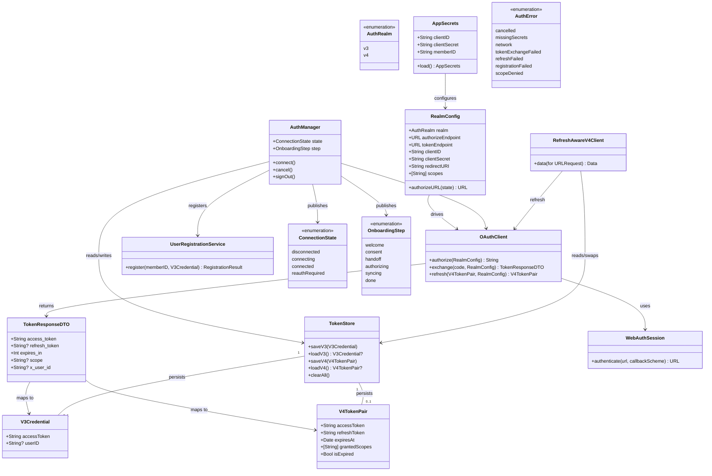

# Polar Authentication & Onboarding Flow (v3 + v4)

## Requirements

- Implement a one-time **Connect Polar** onboarding flow that authenticates the user against **two Polar OAuth realms** (v3 AccessLink and v4), registers the user, and flips the app from an onboarding state to the dashboard.
- Acquire and persist a long-lived **v3 bearer** (≈10 yr, no refresh) and a **v4 access+refresh token pair** (1 h / ≈100 d) securely in the Keychain.
- Provide a **refresh-aware v4 transport** that transparently refreshes the access token on expiry/401 and retries once, surfacing a clean re-auth path when refresh fails.
- Render the onboarding experience (Welcome → Grant access → Secure hand-off → Authorizing → Initial sync) in the Hercules instrument design language.
- **Boundary:** read-only access only; no data is written back to Polar. Initial-sync execution is **stubbed** (real sync is EPIC 5). Phase-1 only — no BLE.
- **Value:** unlocks every downstream data epic — without stored, refreshable credentials and a registered user, no v3/v4 fetch can run.

## Entities

**Conservative notes:** reuse the existing `Keychain` (no new secret store); do **not** modify `PolarDatabase` schema in this slice — the "registered" flag persists as a simple Keychain/UserDefaults-non-sensitive marker derived from credential presence. `TokenResponseDTO` is a thin `Codable` mirror of the wire payload, not a domain type.

## Approach

1. **OAuth orchestration (two realms, one logical step):**
   - Model each realm as a `RealmConfig` (authorize/token endpoints, client creds, redirect URI, scopes). v3 scope = `accesslink.read_all`; v4 = the full space-delimited scope list from `ARCHITECTURE.md` §7.
   - Drive the secure hand-off with `ASWebAuthenticationSession` (ephemeral session, `prefersEphemeralWebBrowserSession`, callback scheme `hercules`). Run **v3 then v4** back-to-back inside a single `connect()` operation, presented to the user as one "Grant data access" moment.
   - Use a `state` nonce per authorize round for CSRF protection; verify it on callback. (Add PKCE only if the realm advertises support — not assumed here.)
   - Token exchange: HTTP `POST` form-encoded with HTTP Basic `client_id:client_secret`; decode `TokenResponseDTO`; map to `V3Credential` / `V4TokenPair` (compute `expiresAt = now + expires_in`). **Note:** this describes the **v4** exchange. v3 and v4 share one client pair, but the v3 token is a different type generated differently — `OAuthClient.exchange` branches per realm, with the exact v3 mechanics to be pinned down in a live debug session.

2. **Secret handling (option c — config seeds Keychain):**
   - Ship a **gitignored** `Secrets.plist` (or `.xcconfig`-driven values) holding the **shared** `client_id`/`client_secret` (one pair used by both realms) and `member-id`. `AppSecrets.load()` treats the bundled plist as the **editable source of truth when present**: it returns the plist values and (re)seeds the Keychain each launch, so editing the plist takes effect immediately (no stale-seed trap). Builds shipped **without** the plist fall back to the previously seeded Keychain values. Document that any shipped secret is extractable (acceptable for a single-user personal app).

3. **Credential persistence & lifecycle:**
   - `TokenStore` wraps the existing `Keychain` with typed accounts (`auth.v3`, `auth.v4`). v3 stored once, never refreshed. v4 stored with `expiresAt` + granted scopes.
   - Derive `ConnectionState` from store contents at app launch: both credentials present + registered ⇒ `connected`; else `disconnected`; a failed v4 refresh transitions to `reauthRequired`.

4. **Refresh-aware v4 transport (single-flight):**
   - `RefreshAwareV4Client` is an `actor`. On a request: attach current access token; if response is 401 or `expiresAt` passed, perform a **single-flight** refresh (concurrent callers await the same in-flight refresh `Task`), swap the stored pair, retry the original request once. If refresh fails, throw `AuthError.refreshFailed` and signal `AuthManager` to set `reauthRequired`.

5. **Onboarding UI & routing:**
   - `AuthManager` (`@MainActor`, `@Observable`) exposes `state` + `step`; the app root routes onboarding vs dashboard. Onboarding views map 1:1 to the design frames; the `handoff`/`authorizing` steps bracket the `ASWebAuthenticationSession` presentation; `syncing` drives a stubbed `InitialSyncProviding`.

6. **Centralized error handling (Swift idiom, not a Spring advice):**
   - A single `AuthError` enum is the typed error currency across the auth layer. `AuthManager.connect()` is the one place errors are caught and mapped to user-facing onboarding states (cancel → back to consent; failure → recoverable error banner; refresh-exhausted → `reauthRequired`). Errors never leak secrets or raw tokens into logs.

## Structure

### Type / Protocol Relationships
1. `OAuthClienting` protocol defines authorize + exchange + refresh; `OAuthClient` is the concrete `URLSession`-backed implementation.
2. `TokenStoring` protocol defines credential persistence; `TokenStore` implements it over the existing `Keychain`.
3. `InitialSyncProviding` protocol defines a `run(progress:)` contract; `StubInitialSyncProvider` implements it now, the real sync engine later (EPIC 5).
4. `WebAuthPresenting` protocol abstracts `ASWebAuthenticationSession` for testability; `WebAuthSession` is the live implementation and the `ASWebAuthenticationPresentationContextProviding` anchor.
5. `AuthError: Error, Equatable` is the shared typed error.

### Dependencies
1. `AuthManager` injects `OAuthClienting`, `TokenStoring`, `UserRegistrationService`, `InitialSyncProviding`.
2. `OAuthClient` depends on `WebAuthPresenting` + `URLSession` + `RealmConfig`.
3. `RefreshAwareV4Client` depends on `TokenStoring` + `OAuthClienting`.
4. `UserRegistrationService` depends on `URLSession` + the v3 `RealmConfig` base + `AppSecrets.memberID`.
5. HerculesUI onboarding views depend only on `AuthManager` (observed); no direct network/Keychain access from the view layer.

### Layered Architecture (mapped to existing modules)
1. **App target** (`App/`): root router observing `AuthManager.state`; injects `AuthManager`; retains `.onOpenURL` as a callback fallback.
2. **HerculesUI**: onboarding screens + a small `Theme` (palette/type from `CLAUDE.md`); presentation only.
3. **PolarProtocol**: `RealmConfig`, `AppSecrets`, credential models, DTOs, `OAuthClient`, `WebAuthSession`, `TokenStore`, `UserRegistrationService`, `RefreshAwareV4Client`, `AuthManager`, `AuthError`.
4. **PolarStore**: unchanged in this slice (no schema migration). Eventual home for `sync_state`.
5. **Cross-cutting error layer**: `AuthError` + the single catch site in `AuthManager.connect()`.

## Operations

> Build order respects dependencies. All code targets Swift 6 strict concurrency; types crossing isolation boundaries are `Sendable`.

### Create Config — AppSecrets + Secrets.plist
1. Responsibility: load client credentials + member-id from a gitignored config and seed the Keychain on first run.
2. Attributes: `clientID`, `clientSecret`, `memberID` (all `String`) — **one client pair shared by v3 and v4**.
3. Methods:
   - `static func load() throws -> AppSecrets`
     - Logic: **plist-first.** If `Secrets.plist` is in the app bundle and decodes, return its values and (re)seed the Keychain (`Keychain.set(_:for:)` for each value + `secrets.seeded`) so plist edits take effect on the next launch. Otherwise, if the Keychain is already seeded, read each value from Keychain and return. Throw `AuthError.missingSecrets` if neither source resolves. **Rationale:** a Keychain-first design caches whatever was seeded on the very first run (e.g. a placeholder), so later plist edits are silently ignored — plist-first avoids that stale-seed trap.
4. Constraints: `Secrets.plist` is added to `.gitignore`; provide a committed `Secrets.example.plist` template. Never log secret values.

### Create Store — TokenStore (`TokenStoring`)
1. Interface: `saveV3`, `loadV3`, `saveV4`, `loadV4`, `clearAll`.
2. Methods:
   - `func saveV3(_ c: V3Credential) throws` / `func loadV3() throws -> V3Credential?`
   - `func saveV4(_ p: V4TokenPair) throws` / `func loadV4() throws -> V4TokenPair?`
     - Logic: JSON-encode the credential, store under accounts `auth.v3` / `auth.v4` via `Keychain.set(_:for:)`; decode on load; return `nil` on absence.
   - `func clearAll() throws` — delete both accounts (used on sign-out / stale-token reset).
3. Dependency: existing `Keychain`. Constraint: credentials are `Codable` + `Sendable`; tokens never enter `UserDefaults`.

### Create Models — credentials, DTO, AuthError
1. `V3Credential { accessToken; userID? }` — `Codable, Sendable`.
2. `V4TokenPair { accessToken; refreshToken; expiresAt; grantedScopes }` with `var isExpired: Bool { Date() >= expiresAt }`.
3. `TokenResponseDTO` — `Codable` mirror of the wire body (`access_token`, `refresh_token?`, `expires_in`, `scope?`, `x_user_id?`); a mapping init builds `V3Credential`/`V4TokenPair`.
4. `enum AuthError: Error, Equatable { cancelled, missingSecrets, network(String), tokenExchangeFailed(Int), refreshFailed, registrationFailed(Int), scopeDenied([String]) }`.

### Create Config — RealmConfig + endpoint constants
1. Responsibility: hold per-realm OAuth configuration.
2. Methods: `func authorizeURL(state: String) -> URL` — compose authorize endpoint with `response_type=code`, `client_id`, `redirect_uri`, `scope` (space-joined), `state`.
3. Constants (verified against a live debug run, 2026-06-26):
   - v3: authorize `https://flow.polar.com/oauth2/authorization`, token `https://polarremote.com/v2/oauth2/token`, scope `accesslink.read_all`.
   - v4: authorize `https://auth.polar.com/oauth/authorize`, token `https://auth.polar.com/oauth/token`, scope = the **12 verified-grantable** scopes: `activity:read calendar:read continuous_samples:read devices:read nightly_recharge:read ppi_data:read routes:read skin_contact:read sleep:read sports:read training_sessions:read training_targets:read`.
   - `redirectURI = "hercules://oauth/callback"` — custom scheme, **confirmed accepted by Polar** (authorize returned the login page / attempted the `hercules://` redirect, not `invalid_redirect_uri`). The exchange `redirect_uri` MUST byte-match the authorize `redirect_uri`.

### Create Wrapper — WebAuthSession (`WebAuthPresenting`)
1. Responsibility: present `ASWebAuthenticationSession` and return the callback URL.
2. Method: `func authenticate(url: URL, callbackScheme: String) async throws -> URL`
   - Logic: wrap the session in `withCheckedThrowingContinuation`; set `prefersEphemeralWebBrowserSession = true`; supply a presentation context anchor; resume with the callback URL, or throw `AuthError.cancelled` on `.canceledLogin`, `AuthError.network` otherwise.
3. Constraint: `@MainActor`; conforms to `ASWebAuthenticationPresentationContextProviding`.

### Implement Client — OAuthClient (`OAuthClienting`)
1. Methods:
   - `func authorize(_ cfg: RealmConfig) async throws -> String` — generate `state`, build `authorizeURL`, call `WebAuthPresenting.authenticate`, validate returned `state`, extract `code`; throw `AuthError.cancelled`/`scopeDenied` as appropriate.
   - `func exchange(code: String, _ cfg: RealmConfig) async throws -> TokenResponseDTO` — **identical HTTP mechanics for both realms** (verified): `POST` to the realm token endpoint, `Authorization: Basic base64(clientID:clientSecret)`, `Accept: application/json`, form body `grant_type=authorization_code` + `code` + `redirect_uri`. On non-2xx throw `AuthError.tokenExchangeFailed(status)`; decode `TokenResponseDTO`. Realms differ only in **response shape**, resolved at mapping time: v3 → `V3Credential(accessToken, userID: x_user_id)` (no refresh, ~10yr); v4 → `V4TokenPair(accessToken, refreshToken, expiresAt: now+expires_in, grantedScopes: parse(scope))`.
   - `func refresh(_ pair: V4TokenPair, _ cfg: RealmConfig) async throws -> V4TokenPair` — `POST` (`grant_type=refresh_token`, `refresh_token`) with Basic auth; on failure throw `AuthError.refreshFailed`; map DTO → new `V4TokenPair` (carry forward refresh token if the response omits one).
2. Dependencies: `WebAuthPresenting`, `URLSession`. Constraint: never log Authorization headers or token bodies.

### Implement Service — UserRegistrationService
1. Method: `func register(memberID: String, credential: V3Credential) async throws -> RegistrationResult`
   - Logic: `POST https://www.polaraccesslink.com/v3/users` with bearer = v3 token, body `{"member-id": memberID}`. Treat `201` = registered, `409`/conflict = alreadyRegistered (no-op success); any other non-2xx ⇒ `AuthError.registrationFailed(status)`. Capture `x_user_id` if returned and persist onto `V3Credential`.
2. Constraint: idempotent — safe to call on every connect.

### Implement Transport — RefreshAwareV4Client (actor, single-flight)
1. Method: `func data(for request: URLRequest) async throws -> (Data, URLResponse)`
   - Logic: load `V4TokenPair`; if `isExpired`, refresh before sending. Attach `Authorization: Bearer`. Send. If `401`: trigger `refreshIfNeeded()` and retry **once**. 
   - `private func refreshIfNeeded() async throws` holds an in-flight `Task<V4TokenPair, Error>?`; concurrent callers await the same task (single-flight); on success swap via `TokenStore.saveV4`; on failure clear the task and throw `AuthError.refreshFailed`.
2. Dependencies: `TokenStoring`, `OAuthClienting`, v4 `RealmConfig`. Constraint: exactly one retry; no infinite refresh loop.

### Implement Orchestrator — AuthManager (`@MainActor`, `@Observable`)
1. Published: `state: ConnectionState`, `step: OnboardingStep`, `lastError: AuthError?`.
2. Methods:
   - `func bootstrap()` — derive initial `state` from `TokenStore` contents (both present ⇒ `connected`, else `disconnected`).
   - `func connect() async` — set `step=.handoff`; `authorize+exchange+saveV3`; `authorize+exchange+saveV4`; `step=.authorizing`; `register`; `step=.syncing`; run `InitialSyncProviding.run`; `step=.done`; `state=.connected`. Catch `AuthError`: `.cancelled` ⇒ `step=.consent`; others ⇒ set `lastError`, keep recoverable step. Treat the whole sequence atomically — on failure of either realm, do **not** report `connected`.
   - `func cancel()` / `func signOut()` — `TokenStore.clearAll()`; `state=.disconnected`.
3. Dependencies injected via initializer; default live implementations provided.

### Create Stub — StubInitialSyncProvider (`InitialSyncProviding`)
1. Method: `func run(progress: @escaping (Double) -> Void) async throws` — emit synthetic progress 0→1 over a short interval so the Initial-sync screen animates. Replaced by the real engine in EPIC 5.

### Create UI — Onboarding screens (HerculesUI)
1. `Theme` — palette + Azeret-Mono type tokens from `CLAUDE.md` (`#000`, `#FE7F2D`, `#233D4D`, `#EAECF0`, `#5E7280`, etc.).
2. `OnboardingFlowView` — switches on `AuthManager.step`; hosts:
   - `WelcomeView` (logo, value prop, CONNECT POLAR CTA → `connect()`),
   - `ConsentView` (read-only scope list, AUTHORIZE CTA),
   - `AuthorizingView` (spinner + handshake rows),
   - `InitialSyncView` (giant %, master bar, per-domain readout bound to sync progress).
   - The `handoff` step coincides with the system `ASWebAuthenticationSession` sheet.
3. Constraint: views are presentation-only; all logic via observed `AuthManager`.

### Wire — App root router
1. In `HerculesApp`: own an `AuthManager`, call `bootstrap()` on launch; route `connected → DashboardPlaceholder`, else `OnboardingFlowView`. Keep `.onOpenURL` as a fallback that forwards to `AuthManager` if the session-based capture is ever bypassed.

## Norms

1. **Concurrency:** async/await throughout; `OAuthClient`/`UserRegistrationService` are `Sendable` value-ish services; `RefreshAwareV4Client` is an `actor`; `AuthManager` and UI are `@MainActor`. All credential models are `Sendable`.
2. **Dependency injection:** protocol-based (`OAuthClienting`, `TokenStoring`, `WebAuthPresenting`, `InitialSyncProviding`); inject via initializers with live defaults; enables unit tests with fakes.
3. **Error handling (Swift idiom):**
   - One typed `AuthError: Error, Equatable` across the auth layer; cases carry minimal context (status codes, denied scopes) — never tokens or secrets.
   - A single catch site (`AuthManager.connect()`) maps errors → onboarding state. No `try?` swallowing in the orchestration path.
   - Network helpers throw `AuthError.network` / `.tokenExchangeFailed(status)` rather than leaking `URLError` upward.
4. **Secret hygiene:** secrets/tokens only in Keychain; `Secrets.plist` gitignored; never `print`/log Authorization headers, codes, or token bodies (redact in any diagnostic output).
5. **Naming/files:** one primary type per file under the owning module; realm constants centralized in `RealmConfig`; no hard-coded endpoint strings scattered across call sites.
6. **Logging:** structured, redaction-safe `print`/logger lines only (e.g. "v4 token refreshed", "registration: alreadyRegistered") — status and outcome, never payloads.

## Safeguards

1. **Functional constraints:** v3 stored once with **no refresh code path**; v4 always stored with `expiresAt` + granted scopes; `connect()` is atomic — partial (one-realm) success must not yield `ConnectionState.connected`.
2. **Performance constraints:** refresh is **single-flight** — N concurrent 401s trigger exactly one refresh; each original request retries at most once; no busy-loop.
3. **Security constraints:** no secret/token in source, `UserDefaults`, logs, `Info.plist`, or the committed project; Keychain items remain `afterFirstUnlockThisDeviceOnly`; `ASWebAuthenticationSession` uses an ephemeral session; `state` nonce validated on every callback.
4. **Integration constraints:** reuse existing `Keychain` unchanged; **no** `PolarDatabase` schema migration in this slice; v4 data path must route through `RefreshAwareV4Client`; v3 path uses the bearer directly.
5. **Business-rule constraints:** request the **full v4 scope set in one consent**; registration idempotent (`201` or conflict both succeed); read-only — no write calls to Polar.
6. **Error-handling constraints:** all auth failures expressed as `AuthError`; user-facing messages are non-alarming and actionable (cancel → consent; failure → retry; refresh-exhausted → `reauthRequired`); errors never expose internal/system detail or credentials.
7. **Technical constraints:** Swift 6 strict-concurrency clean (no data races, `Sendable` across boundaries); `ASWebAuthenticationSession` presented on `@MainActor` with a valid context anchor; builds for iOS 26 simulator and device.
8. **Data constraints:** `TokenResponseDTO` tolerates optional `refresh_token`/`scope`/`x_user_id`; `expiresAt` computed from `expires_in`; granted scopes parsed from the space-delimited `scope` response (fall back to requested scopes if absent).
9. **Verified flow (live debug run 2026-06-26) + the one remaining decision:**
   - **Shared client pair** — CONFIRMED. `client_id` (public, = §13) + `client_secret` (Keychain-only) used by both realms.
   - **Exchange mechanics identical across realms** — CONFIRMED end-to-end: Basic-auth header + form auth-code grant. No v3 special-casing in the request.
   - **v3 response** = `{ access_token (opaque hex), token_type: bearer, expires_in: 315359999 (~10yr), x_user_id }` — no refresh token, no scope echo. Store the bearer and capture `x_user_id` (the numeric AccessLink user id reused by registration + data calls; matches `64433870` in §13).
   - **v4 response** = `{ access_token (JWT), refresh_token (JWT), token_type: bearer, expires_in: 3599 (1h), jti, scope }` — store the pair + parse granted `scope`; `jti` ignored.
   - **RESOLVED — callback capture.** Custom scheme `hercules://oauth/callback` + `ASWebAuthenticationSession` (callbackURLScheme `hercules`). Confirmed accepted by Polar via browser test (desktop browsers can't open `hercules://`, but Polar attempted the redirect → the scheme is registered). No hosting / domain / localhost listener needed; iOS routes the scheme to the app. Exchange `redirect_uri` byte-matches the authorize one.
   - **`member-id`** from `Secrets.plist` (default `yug-hercules-test` per §13).
   - **Initial sync stubbed**; **PKCE not used** — the verified flow is plain auth-code, no `code_challenge`.
