# AccessLink v3 + v4 Data Clients (Epic 2 & Epic 3)

## Requirements

Implement the **decode-only typed API client layer** for Polar AccessLink, covering every v3 data endpoint (Epic 2) and the three v4 endpoints (Epic 3), so that later epics can fetch any dashboard metric as a strongly-typed Swift value.

- **Provide** one client method per endpoint family that composes a correctly-formatted request, routes it through the realm-appropriate auth transport, and returns a typed `Decodable` model.
- **Centralize** the two Polar date dialects (`YYYY-MM-DD` for all v3; naive `YYYY-MM-DDTHH:MM:SS` for v4 `training-sessions/list`) into one tested utility — the single largest historical bug source.
- **Bound memory** on high-frequency series (continuous HR ~5-sec, ≈16 MB/28 d; activity step samples) by **down-sampling to per-minute buckets inside the client**, so raw native-resolution arrays never escape the client.
- **Establish** a thin v3 transport (bearer-only, no refresh) symmetric to the existing `RefreshAwareV4Client`, and route **all** v4 calls through that existing actor.

**Boundary (explicitly out of scope):** no GRDB persistence, no row-writing, no multi-domain sync orchestration, no per-domain windows, no range-cap paging, no catalog/manifest caching behavior. Clients return models and nothing else; storage is Epic 4, orchestration is Epic 5. The down-sampling **transform** is in scope (per user decision); writing minute rows to the store is not.

---

## Entities

```mermaid
classDiagram
direction TB

%% ---- Shared transport + utilities ----
class V3Credential {
  +String accessToken
  +String? userID
}
class RefreshAwareV4Client {
  <<actor, existing>>
  +data(URLRequest) (Data, URLResponse)
}
class TokenStoring {
  <<protocol, existing>>
  +loadV3() V3Credential?
  +loadV4() V4TokenPair?
}
class AuthError {
  <<enum, existing+extended>>
  +network(String)
  +httpStatus(Int)
  +decoding(String)
}
class PolarDateFormat {
  <<enum, static>>
  +dateOnly(Date, TimeZone) String
  +naiveDateTime(Date, TimeZone) String
}
class DateWindow {
  +Date from
  +Date to
}
class V3Transport {
  +TokenStoring store
  +URLSession session
  +get(path, query) Data
}

%% ---- v3 clients + models ----
class V3DataClient {
  +V3Transport transport
  +fetchSleep() [SleepNight]
  +fetchNightlyRecharge() [NightlyRecharge]
  +fetchCardioLoad() [CardioLoad]
  +fetchContinuousHeartRate(DateWindow) [HeartRateMinute]
  +fetchDailyActivity(DateWindow) [ActivityDay]
  +fetchActivitySamples(Date) ActivitySamples
  +fetchSleepManifest() [SleepAvailability]
}
class SleepNight {
  +String date
  +[Int] hypnogram
  +SleepStageTotals stages
  +[HeartRateSample] heartRateSamples
  +Int? sleepScore
  +SleepContinuity? continuity
}
class NightlyRecharge {
  +String date
  +Int? ansCharge
  +RechargeStatus status
  +[Sample] hrvSamples
  +[Sample] breathingSamples
}
class CardioLoad {
  +String date
  +Double strain
  +Double tolerance
  +Double ratio
  +CardioLoadStatus status
}
class HeartRateSample {
  +Date timestamp
  +Int heartRate
}
class HeartRateMinute {
  +Date minute
  +Int min
  +Int avg
  +Int max
}
class ActivityDay {
  +String date
  +Int steps
  +Int calories
  +Int activeCalories
  +TimeInterval activeDuration
  +TimeInterval inactiveDuration
  +Int dailyActivity
  +Int inactivityAlertCount
  +Double distanceFromSteps
}
class ActivitySamples {
  +String date
  +[StepMinute] steps
  +[ActivityZone] activityZones
  +[InactivityStamp] inactivityStamps
}
class StepMinute {
  +Date minute
  +Int steps
}
class ActivityZone {
  +Int index
  +TimeInterval inZone
}
class SleepAvailability {
  +String date
  +Date? start
  +Date? end
}

%% ---- v4 clients + models ----
class V4DataClient {
  +RefreshAwareV4Client transport
  +fetchTrainingSessions(DateWindow) [TrainingSession]
  +fetchSports() [Sport]
  +fetchDevices() [Device]
}
class TrainingSession {
  +String id
  +Date startTime
  +Date stopTime
  +Int sportID
  +Int? calories
  +Int? hrAvg
  +Int? hrMax
  +String? trainingBenefit
  +Int? recoveryTimeMillis
  +String? note
  +StartTrigger startTrigger
  +[Exercise] exercises
}
class Exercise {
  +Double? fatPercentage
  +Double? carboPercentage
  +Double? proteinPercentage
}
class Sport {
  +Int id
  +String name
}
class Device {
  +String deviceID
  +String? firmware
  +String? color
  +Date? registered
  +DeviceSettings settings
}
class DeviceSettings {
  +Bool? automaticTrainingDetection
}
class Downsampler {
  <<static>>
  +heartRateMinutes([HeartRateSample]) [HeartRateMinute]
  +stepMinutes([RawStepSample]) [StepMinute]
}

V3DataClient --> V3Transport : uses
V3Transport --> TokenStoring : reads V3Credential
V3DataClient --> SleepNight : decodes
V3DataClient --> NightlyRecharge : decodes
V3DataClient --> CardioLoad : decodes
V3DataClient --> ActivityDay : decodes
V3DataClient --> ActivitySamples : decodes
V3DataClient --> SleepAvailability : decodes
V3DataClient --> Downsampler : continuous HR + steps
Downsampler --> HeartRateMinute : produces
Downsampler --> StepMinute : produces
SleepNight "1" -- "N" HeartRateSample : contains
ActivitySamples "1" -- "N" StepMinute : contains
ActivitySamples "1" -- "N" ActivityZone : contains
V4DataClient --> RefreshAwareV4Client : routes all calls
V4DataClient --> TrainingSession : decodes
V4DataClient --> Sport : decodes
V4DataClient --> Device : decodes
TrainingSession "1" -- "N" Exercise : contains
Device "1" -- "1" DeviceSettings : has
V3DataClient ..> PolarDateFormat : dateOnly
V4DataClient ..> PolarDateFormat : naiveDateTime
V3DataClient ..> DateWindow : range params
V4DataClient ..> DateWindow : range params
```

**Conservative notes:** `V4TokenPair`, `RefreshAwareV4Client`, `TokenStoring`, `V3Credential`, and `AuthError` already exist and are **reused unchanged** except for two additive `AuthError` cases (`httpStatus`, `decoding`). No existing type is refactored. Raw sample shapes (`HeartRateSample`, `RawStepSample`) are internal decode intermediates that do not escape the client — only the bucketed `HeartRateMinute` / `StepMinute` are returned.

---

## Approach

1. **Transport symmetry across realms**:
   - **v4**: every client method builds a `URLRequest` (base `https://www.polaraccesslink.com/v4/data`) and hands it to the **existing** `RefreshAwareV4Client.data(for:)` actor — never a bare `URLSession`. This preserves single-flight refresh-on-401 (Safeguard 4).
   - **v3**: introduce a thin `V3Transport` (base `https://www.polaraccesslink.com/v3`) that reads the stored `V3Credential`, sets `Authorization: Bearer <token>`, executes, and maps status → `AuthError`. It is the v3 analogue of the v4 client **minus any refresh path** (v3 issues no refresh token). Mirrors the established `UserRegistrationService` calling pattern.

2. **Centralized date-dialect formatting**:
   - One `PolarDateFormat` utility exposes exactly two pure functions: `dateOnly` (`YYYY-MM-DD`) and `naiveDateTime` (`YYYY-MM-DDTHH:MM:SS`, **no zone/offset/millis suffix**). Both use a fixed `en_US_POSIX` locale and an explicit `TimeZone` parameter (caller supplies the local-day boundary).
   - **Decision rationale:** this is the codebase's worst historical bug (ARCHITECTURE §4); a single tested formatter prevents any v4 datetime endpoint from receiving a zoned string and makes the rule enforceable in one place.
   - `training-sessions/list` request builder **omits `features` entirely** (sending it 400s).

3. **In-client down-sampling for high-frequency series** (user-confirmed in scope):
   - A pure `Downsampler` buckets continuous-HR `HeartRateSample[]` into per-minute `min/avg/max` and step samples into per-minute totals. The continuous-HR and activity-samples client methods decode the raw arrays, bucket immediately, and return **only** the minute buckets — raw native-resolution arrays are released within the decode scope so peak memory stays bounded on multi-day pulls.

4. **Tolerant, typed decoding**:
   - Models are `Decodable` `struct`s with explicit `CodingKeys` for snake_case JSON. Fields not guaranteed present are `Optional`; stringly-typed fields (`status`, `startTrigger`) decode into enums with an `unknown(String)`/raw fallback so an unrecognized value never fails the whole response. Empty arrays / `204` are treated as success (no data), not errors.

5. **Unified error currency**:
   - Both transports map non-2xx to `AuthError.httpStatus(Int)` and decode failures to `AuthError.decoding(String)`, reusing the existing redaction-safe enum rather than inventing a parallel error type. No transport logs tokens or Authorization headers (existing Norm 4).

---

## Structure

### Protocol / Type Relationships
1. `TokenStoring` (existing protocol) is read by the new `V3Transport` to obtain the v3 bearer.
2. `V3Transport` is a concrete `struct` providing `get(path:query:) async throws -> Data`; it is the v3 analogue of the existing `RefreshAwareV4Client` actor (no shared base type — they differ in refresh semantics).
3. `V3DataClient` and `V4DataClient` are `struct`s that depend on their respective transports; each owns the endpoint paths and decoding for its realm.
4. `PolarDateFormat` and `Downsampler` are stateless `enum`s exposing only `static` pure functions.
5. `AuthError` (existing enum) gains two additive cases — `httpStatus(Int)`, `decoding(String)` — and remains the single error currency.

### Dependencies
1. `V3DataClient` depends on `V3Transport`, `PolarDateFormat`, and `Downsampler`.
2. `V4DataClient` depends on `RefreshAwareV4Client` (existing) and `PolarDateFormat`.
3. `V3Transport` depends on `TokenStoring` (existing) and `URLSession`.
4. No client depends on `PolarStore` / GRDB — the persistence boundary is respected.

### Layered Architecture (data layer only — no UI, no DB)
1. **Transport layer**: `V3Transport` (bearer-only) and `RefreshAwareV4Client` (existing, refresh-aware) — request execution + status→error mapping.
2. **Client layer**: `V3DataClient` / `V4DataClient` — endpoint composition, date formatting, decoding, down-sampling.
3. **Model layer**: per-domain `Decodable` value types + small fallback enums.
4. **Utility layer**: `PolarDateFormat`, `Downsampler`, `DateWindow` — pure functions/value types.
5. **Error layer**: the existing `AuthError` enum (extended) — there is no `GlobalExceptionHandler` equivalent on iOS; errors propagate via Swift `throws` and are mapped to onboarding/dashboard state by existing callers (`AuthManager`, future sync engine).

### Module / Folder Placement
- All new files live in `Packages/Sources/PolarProtocol/`, in new sibling folders to `Auth/`:
  - `Networking/` → `V3Transport.swift`, `PolarDateFormat.swift`, `DateWindow.swift`, `Downsampler.swift`
  - `V3/` → `V3DataClient.swift` + per-domain model files
  - `V4/` → `V4DataClient.swift` + per-domain model files

---

## Operations

### Update Enum - AuthError (additive only)
1. Responsibility: remain the single redaction-safe error currency for the data layer.
2. Add cases:
   - `case httpStatus(Int)` — a data request returned a non-2xx status (carries only the code).
   - `case decoding(String)` — a response body failed to decode (carries a redaction-safe summary, never the body).
3. Constraints: do **not** remove or rename existing cases; preserve `Equatable`/`Sendable` conformance.

### Create Utility - PolarDateFormat
1. Responsibility: the **only** place Polar date strings are produced.
2. Methods:
   - `static func dateOnly(_ date: Date, timeZone: TimeZone = .current) -> String`
     - Logic: format with `DateFormatter` (locale `en_US_POSIX`, format `yyyy-MM-dd`, given `timeZone`). Used by all v3 ranged params and `/activities/{date}` path dates.
   - `static func naiveDateTime(_ date: Date, timeZone: TimeZone = .current) -> String`
     - Logic: format `yyyy-MM-dd'T'HH:mm:ss` (locale `en_US_POSIX`, given `timeZone`). **No `Z`, no offset, no fractional seconds.** Used **only** by `training-sessions/list`.
3. Constraints: never emit a zoned/offset/millis form from `naiveDateTime`; formatters are cached `static let` to avoid per-call allocation.

### Create Value Type - DateWindow
1. Responsibility: carry a `from`/`to` Date pair for ranged endpoints.
2. Attributes: `from: Date`, `to: Date`.
3. Methods: `func dateOnlyParams() -> [URLQueryItem]` and `func naiveDateTimeParams() -> [URLQueryItem]` returning `from`/`to` query items via `PolarDateFormat`.
4. Constraints: `Sendable`; does **not** clamp to API range caps (that is Epic 5) — it only formats.

### Create Transport - V3Transport
1. Responsibility: execute authenticated v3 GET requests (bearer-only) and map failures.
2. Attributes: `store: any TokenStoring`, `session: URLSession`, `base = URL("https://www.polaraccesslink.com/v3")`.
3. Methods:
   - `func get(path: String, query: [URLQueryItem] = []) async throws -> Data`
     - Logic:
       - `guard let cred = try store.loadV3() else { throw AuthError.refreshFailed }` (no v3 credential ⇒ re-auth needed; reuse existing case semantics).
       - Build `URLRequest` from `base` + `path` + `query`; set `Authorization: Bearer <cred.accessToken>` and `Accept: application/json`.
       - Execute via `session.data(for:)`; on transport throw → `AuthError.network("v3 request failed")`.
       - Read status: `200..<300` → return `Data` (empty Data on 204 is valid); else → `AuthError.httpStatus(status)`.
4. Constraints: never log the Authorization header or token (Norm 4); no refresh logic of any kind.

### Create Utility - Downsampler
1. Responsibility: pure per-minute bucketing so raw high-frequency arrays never escape a client.
2. Methods:
   - `static func heartRateMinutes(_ samples: [HeartRateSample]) -> [HeartRateMinute]`
     - Logic: group samples by floor-to-minute of `timestamp`; per bucket compute `min`, integer `avg` (rounded), `max`; emit ascending by minute. Tolerate gaps and partial minutes (no fixed sample count assumed).
   - `static func stepMinutes(_ raw: [RawStepSample], interval: TimeInterval) -> [StepMinute]`
     - Logic: aggregate step counts into per-minute totals keyed on minute timestamp (input is already ~60 000 ms interval; normalize/sum any finer samples into the minute).
3. Constraints: pure (no I/O, no shared state); input arrays may be released by the caller immediately after the call returns.

### Create Client - V3DataClient
1. Responsibility: one decode-only method per v3 endpoint family.
2. Attributes: `transport: V3Transport`, `decoder: JSONDecoder` (configured per Norms).
3. Core methods (each: build query via `PolarDateFormat`/`DateWindow` → `transport.get` → decode envelope → return typed model; decode failure → `AuthError.decoding`):
   - `fetchSleep() async throws -> [SleepNight]` — GET `/users/sleep`, decode `nights[]`. Empty `nights` ⇒ `[]`.
   - `fetchNightlyRecharge() async throws -> [NightlyRecharge]` — GET `/users/nightly-recharge`, decode `recharges[]`; keep 5-min `hrv_samples`/`breathing_samples` intact (no down-sampling).
   - `fetchCardioLoad() async throws -> [CardioLoad]` — GET `/users/cardio-load`; map `status` string → `CardioLoadStatus` enum with `unknown` fallback.
   - `fetchContinuousHeartRate(_ window: DateWindow) async throws -> [HeartRateMinute]` — GET `/users/continuous-heart-rate?from=&to=` (dateOnly). Decode raw `[HeartRateSample]`, immediately call `Downsampler.heartRateMinutes`, return buckets only. Raw array goes out of scope before return (bounded memory).
   - `fetchDailyActivity(_ window: DateWindow) async throws -> [ActivityDay]` — GET `/users/activities?from=&to=` (dateOnly); decode computed totals; parse ISO-8601 `active_duration`/`inactive_duration` to `TimeInterval`. (Also support a `fetchDailyActivity(date: Date)` single-day variant hitting `/users/activities/{dateOnly}`.)
   - `fetchActivitySamples(date: Date) async throws -> ActivitySamples` — GET `/users/activities/samples/{dateOnly}`; decode `activity_zones` + `inactivity_stamps` verbatim; down-sample step `samples[]` via `Downsampler.stepMinutes`; return with `steps` as minute buckets.
   - `fetchSleepManifest() async throws -> [SleepAvailability]` — GET `/users/sleep/available`, decode `available[]`. (Client only; orchestration that uses it to skip nights is Epic 5.)
4. Constraints: returns models only; no persistence; no range-cap clamping.

### Create Client - V4DataClient
1. Responsibility: the three v4 endpoints, all routed through `RefreshAwareV4Client`.
2. Attributes: `transport: RefreshAwareV4Client` (existing actor), `decoder: JSONDecoder`, `base = URL("https://www.polaraccesslink.com/v4/data")`.
3. Core methods (each: build `URLRequest` → `await transport.data(for:)` → check status → decode):
   - `fetchTrainingSessions(_ window: DateWindow) async throws -> [TrainingSession]` — GET `/training-sessions/list?from=&to=` using **`naiveDateTime`**; **no `features` param**. Decode inline summary + `exercises[]` macros + `startTrigger` (`AUTOMATIC_TRAINING_DETECTION` flagged) + `sport.id`.
   - `fetchSports() async throws -> [Sport]` — GET `/sports/list` (no dates); decode `{ id:{id}, name }` → `Sport(id, name)`. (Caching across syncs is Epic 4/5.)
   - `fetchDevices() async throws -> [Device]` — GET `/user-devices` (no dates); decode firmware/UUID/color/registration/`deviceSettings`; **battery absence is expected**, modeled as no field (not a decode error).
4. Constraints: no method constructs its own `URLSession`; all transport goes through the injected actor (Safeguard 4). Map non-2xx → `AuthError.httpStatus`, decode failure → `AuthError.decoding`.

### Create Models - per-domain Decodable types
1. v3: `SleepNight`, `SleepStageTotals`, `SleepContinuity`, `HeartRateSample` (internal), `HeartRateMinute`, `NightlyRecharge`, `Sample`, `RechargeStatus`, `CardioLoad`, `CardioLoadStatus`, `ActivityDay`, `ActivitySamples`, `StepMinute`, `RawStepSample` (internal), `ActivityZone`, `InactivityStamp`, `SleepAvailability`.
2. v4: `TrainingSession`, `Exercise`, `StartTrigger`, `Sport`, `Device`, `DeviceSettings`.
3. Each: `Decodable` (+ `Sendable`, `Equatable` where useful); explicit `CodingKeys` mapping snake_case JSON; optionals for non-guaranteed fields; envelope wrappers (e.g. `private struct SleepEnvelope: Decodable { let nights: [SleepNight] }`) kept `private` to the client file.

---

## Norms

1. **Type & API conventions**: new public surface is `public struct`/`enum`; pure utilities are `enum` with `static` functions. All public types conform to `Sendable`; models also `Equatable` where it aids tests. No class unless reference semantics are required (none are here).
2. **Dependency injection**: transports and decoders are injected via initializers with sensible defaults (`session: URLSession = .shared`); clients receive their transport — no global singletons.
3. **Decoding standards**:
   - One configured `JSONDecoder` per client; explicit `CodingKeys` (do not rely on a global `.convertFromSnakeCase` so field mapping is auditable).
   - Optional for any field not guaranteed by ARCHITECTURE §7; arrays default to empty, not nil-failing.
   - Stringly-typed enums (`CardioLoadStatus`, `RechargeStatus`, `StartTrigger`) implement a custom `init(from:)` with an `unknown(String)` (or `.other`) case — an unrecognized value must never fail the parent decode.
   - Response envelopes are `private` nested types; only domain models are public.
4. **Error handling**:
   - Single currency: `AuthError`. Map transport failures → `.network`, non-2xx → `.httpStatus(Int)`, decode failures → `.decoding(String)`.
   - Error payloads carry only codes/safe summaries — **never** tokens, headers, or raw response bodies.
   - There is no centralized exception filter on iOS; errors surface via `throws` and are interpreted by callers. Empty/`204`/empty-array responses are normal successes, not errors.
5. **Endpoint centralization (existing Norm 5)**: base URLs and paths live with their transport/client — never duplicated at call sites. The two date formats live **only** in `PolarDateFormat`.
6. **Logging (existing Norm 4)**: no Authorization header, bearer, or token value is ever logged. Diagnostic logs use endpoint + status only.
7. **Documentation**: each public type/method carries a doc comment stating its endpoint, date dialect, and any down-sampling/empty-response behavior, consistent with the existing `Auth/` file style.

---

## Safeguards

1. **Functional constraints**: each client method returns a fully-typed model decoded from a real Polar response; `fetchSleep` parses ~25 nights, `fetchCardioLoad` a 28-day series, `fetchTrainingSessions` ≥24 sessions — all from a captured live sample, with no persistence side effects.
2. **Performance / memory constraints**: continuous-HR and activity-sample methods must **never** hold the full raw native-resolution array beyond the decode-then-bucket step; peak memory for a multi-day pull is bounded to one window's buckets. (AC HERC-023: "a multi-day pull never persists raw 5-sec rows; peak memory bounded.")
3. **Security constraints**: tokens read from Keychain via `TokenStoring` only; never written to `UserDefaults`, never logged, never embedded in error values (reaffirms existing Safeguards 1–3).
4. **Integration constraints (existing Safeguard 4)**: **all** v4 data calls route through `RefreshAwareV4Client`; no v4 client may own a `URLSession`. v3 calls use the bearer directly with **no** refresh path.
5. **Business-rule constraints**:
   - v3 requests use `dateOnly`; `training-sessions/list` uses `naiveDateTime`; any other dialect on these endpoints is a defect.
   - `training-sessions/list` is sent **without** a `features` param.
   - Device model treats absent battery as expected (documented), not a decode failure.
6. **Error-handling constraints**: every non-2xx maps to `AuthError.httpStatus(Int)` and every decode failure to `AuthError.decoding(String)`; error values expose no sensitive internals; unknown enum strings degrade to a fallback case rather than throwing.
7. **Technical constraints**: code targets Swift 6.2 / iOS 26, concurrency-safe (`Sendable`), lives in `PolarProtocol` with **no** dependency on `PolarStore`/GRDB or `HerculesUI`. No existing type is refactored beyond the two additive `AuthError` cases.
8. **Data constraints**: snake_case JSON mapped via explicit `CodingKeys`; ISO-8601 duration strings (`active_duration`) parsed to `TimeInterval`; minute buckets keyed on floor-to-minute timestamps; partial/empty arrays tolerated.
9. **API constraints**: base URLs fixed (`/v3` → `www.polaraccesslink.com/v3`, `/v4` → `www.polaraccesslink.com/v4/data`); range windows are accepted as given and **not** clamped to API caps here (Epic 5 owns paging) — but the boundary is documented so an over-cap request's `400` is attributable.

---

### Out-of-scope tail (deferred, tracked for later epics)
- Writing minute/day/session rows to GRDB tables — **Epic 4** (HERC-040/041/042).
- Manifest-driven night skipping, sports-catalog caching/reuse, range-cap splitting/paging, per-domain windows, orchestrated "fetch everything" pass — **Epic 5** (HERC-050/051/052/053).
- Graph/zone-bar rendering from decoded data — **Epic 6**.
