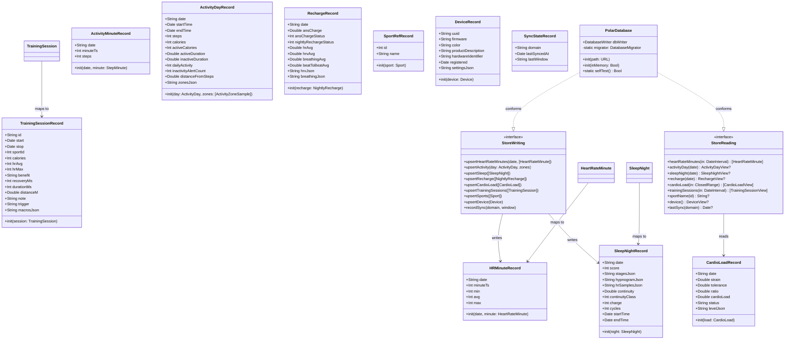

# Epic 4 — Local Store (GRDB) Tables, Upserts & Read APIs

> Stack note: this is a Swift 6 / SwiftUI iOS app using **GRDB** (SQLite) inside the
> `PolarStore` SPM target, which depends on `PolarProtocol` (wire models) + `GRDB`.
> The generic Spring/Java vocabulary of the framework (Controller/Service/Repository,
> `GlobalExceptionHandler`, `@RestControllerAdvice`) is adapted to Swift idioms:
> records (GRDB `PersistableRecord`), a store facade type, mapper initializers, and a
> typed `StoreError` enum. There is no HTTP layer in this epic.

## Requirements

Persist the live-verified Polar wire models (Epic 2/3) into a local GRDB/SQLite store
so the dashboard reads every screen entirely from disk, with zero network in the read
path.

- **Establish the schema** — create the ten tables (`hr_minute`, `activity_minute`,
  `activity_day`, `sleep_night`, `recharge`, `cardio_load`, `training_session`,
  `sport_ref`, `device`, `sync_state`) via a single, idempotent GRDB migration, with
  natural-key primary keys and `*_json` columns for time-keyed maps / nested objects.
- **Guarantee idempotent persistence** — upsert each domain on its natural key so
  re-syncing an overlapping window converges to identical row counts and contents.
- **Serve display-ready reads** — query functions over date windows / ids that return
  rehydrated, UI-ready data purely from SQLite, fast enough for card rendering (<16 ms
  on a populated DB).

Boundary: this epic owns *persistence and retrieval only*. It does **not** orchestrate
*when* to fetch (Epic 5 sync engine) nor render (Epic 6 UI). `PolarProtocol` stays
DB-free; all GRDB code lives in `PolarStore`.

## Entities

> Conservative-design note: the `PolarProtocol` wire structs (`SleepNight`,
> `NightlyRecharge`, `CardioLoad`, `ActivityDay`, `HeartRateMinute`, `StepMinute`,
> `TrainingSession`, `Sport`, `Device`, …) are **not modified** — no GRDB conformance is
> added to them. Records are new, additive types in `PolarStore` that map *from* them.
> The `*View` read-models are thin projections; where a table has no JSON column
> (`sport_ref`, the minute tables) the read API may return the record/value directly
> rather than introducing a redundant view.

## Approach

1. **Schema & migration strategy**
   - Single registered migration `"v1"` on the existing `PolarDatabase.migrator` that
     `create`s all ten tables. Replace the commented-out placeholder; keep
     `eraseDatabaseOnSchemaChange` under `#if DEBUG` only.
   - Primary keys are the **natural keys** (per `API_RESPONSE_SHAPES.md` / ARCHITECTURE
     §9): `date` for day/night tables; composite `(date, minute_ts)` for the minute
     tables; `id` for `training_session` (uuid) and `sport_ref` (int); `uuid` for
     `device`; `domain` for `sync_state`. Date/id reads use the PK directly; **the minute
     tables additionally carry a secondary index on `minute_ts`** because time-range
     reads filter on `minute_ts` alone, which the date-first composite PK cannot serve.
   - Column typing mirrors the wire quirks: `recharge.ans_charge` is REAL (signed),
     `training_session.sport_id` / `recovery_ms` are INTEGER (normalized from wire
     strings), time-keyed maps + nested objects are TEXT `*_json`.

2. **Record + mapping layer**
   - One `Codable` struct per table conforming to GRDB `FetchableRecord` +
     `PersistableRecord`, with `static let databaseTableName` and an explicit
     `databasePrimaryKey` where composite.
   - Each record exposes a failable/throwing `init(from wireModel:)` that performs the
     **one-time normalization**: stringified→Int, signed Double pass-through, and JSON
     encoding of maps/objects via a shared `StoreJSON` helper (a single
     `JSONEncoder`/`JSONDecoder` pair with stable settings).
   - Date columns store a canonical form: day/night `date` as the wire `"YYYY-MM-DD"`
     TEXT string (already provided by the wire models); `minute_ts` as **epoch seconds
     Int** (from `HeartRateMinute.minute` / `StepMinute.minute`, which are UTC-floored
     `Date`s) so composite-key comparison and window range queries are integer-fast and
     collision-free across days.

3. **Write (upsert) strategy**
   - A `StoreWriting` facade on `PolarDatabase` with one method per domain. Each method
     maps wire→record and performs a GRDB `save`/`upsert` inside a **single
     `dbWriter.write {}` transaction** (batched per domain/day) — idempotent because the
     PK is the natural key, so re-syncing overwrites in place (identical counts/contents).
   - Empty input is a no-op success (returns without error), honoring partial/empty
     domains.
   - `recordSync(domain:window:)` updates the `sync_state` row in the same style (for
     Epic 5 to call; written now so the table is exercised).

4. **Read strategy**
   - A `StoreReading` facade on `PolarDatabase`, all methods `dbWriter.read {}` (no
     network). Window queries range over the indexed key; JSON columns are decoded back
     into maps/arrays via `StoreJSON` and surfaced through `*View` read-models so the UI
     never parses JSON.
   - `sportName(id:)` and the session reads are independent: a session row is returned
     even if its `sport_id` is absent from `sport_ref` (resolution is a read-time lookup,
     not a join constraint).

5. **Error handling strategy (Swift-idiomatic)**
   - A typed `StoreError` enum (`migrationFailed`, `encodingFailed(String)`,
     `decodingFailed(String)`, `notFound`) is the store's error currency, mirroring the
     existing `AuthError` convention in `PolarProtocol`. Writes/reads are `throws`;
     callers (Epic 5/6) handle. No exceptions are swallowed silently; JSON
     encode/decode failures surface as `StoreError`, never as a corrupt row.

## Structure

### Inheritance / Conformance Relationships
1. Each `*Record` struct conforms to `Codable`, GRDB `FetchableRecord`, and GRDB
   `PersistableRecord` (via `Codable`), with `static var databaseTableName`.
2. `HRMinuteRecord` and `ActivityMinuteRecord` declare a composite primary key
   `(date, minute_ts)` through the migration's `primaryKey([...])`.
3. `PolarDatabase` conforms to two new protocols, `StoreWriting` and `StoreReading`,
   that define the persistence and query contracts (extension points for Epic 5/6 and
   for test doubles).
4. `StoreError` conforms to `Error` (and `Equatable` for testability), analogous to
   `PolarProtocol`'s `AuthError`.

### Dependencies
1. `PolarStore` depends on `PolarProtocol` (wire models, source of the mappers) and
   `GRDB` (already declared in `Package.swift` — no manifest change required).
2. `*Record` mapper initializers depend on their corresponding `PolarProtocol` wire
   model and on `StoreJSON` (the shared encoder/decoder).
3. `PolarDatabase` (writing/reading facades) depends on the `*Record` types and on
   `GRDB`'s `DatabaseWriter`.
4. Epic 5 (sync engine) and Epic 6 (UI) will depend **on the `StoreWriting` /
   `StoreReading` protocols**, not on the records directly.

### Layered Architecture
1. **Wire/model layer (`PolarProtocol`, unchanged):** decode-only structs, no DB.
2. **Mapping layer (`PolarStore`, new):** `*Record` types + `init(from wireModel:)` +
   `StoreJSON` — the only place wire quirks are normalized.
3. **Schema layer (`PolarStore`, new):** the `"v1"` migration defining all tables/keys.
4. **Store facade layer (`PolarStore`, new):** `StoreWriting` / `StoreReading` on
   `PolarDatabase` — transactional writes, windowed reads, `*View` projections.
5. **Error layer (`PolarStore`, new):** `StoreError` typed enum.

## Operations

### Create Helper — `StoreJSON`
1. Responsibility: single, stable JSON encode/decode for all `*_json` columns.
2. Methods:
   - `encode<T: Encodable>(_ value: T) throws -> String`
     - Logic: encode with a shared `JSONEncoder` (no pretty-print, deterministic);
       convert `Data`→`String(utf8)`; throw `StoreError.encodingFailed` on failure.
   - `decode<T: Decodable>(_ type: T.Type, from json: String) throws -> T`
     - Logic: `String`→`Data`; decode with a shared `JSONDecoder`; throw
       `StoreError.decodingFailed` on failure.
3. Constraints: do not rely on JSON object key ordering for `"HH:MM"` maps — consumers
   sort keys at read time.

### Create Error — `StoreError`
1. Inheritance: `enum StoreError: Error, Equatable`.
2. Cases: `migrationFailed(String)`, `encodingFailed(String)`, `decodingFailed(String)`,
   `notFound`.
3. Usage: thrown by mappers (`encode`/`decode`), by migration setup, and by read APIs
   when a required row is absent. Never carries sensitive data.

### Update — `PolarDatabase.migrator` (HERC-040)
1. Responsibility: define the full phase-1 schema in one migration.
2. Method: register migration `"v1"` performing `db.create(table:)` for all ten tables.
3. Logic (per table — columns from `API_RESPONSE_SHAPES.md`):
   - `hr_minute`: `date` TEXT NOT NULL, `minute_ts` INTEGER NOT NULL, `min` INT,
     `avg` INT, `max` INT — **primary key `(date, minute_ts)`**.
   - `activity_minute`: `date` TEXT NOT NULL, `minute_ts` INTEGER NOT NULL, `steps` INT
     — **primary key `(date, minute_ts)`**.
   - `activity_day`: `date` TEXT PRIMARY KEY, `start_time` DATETIME, `end_time` DATETIME,
     `steps` INT, `calories` INT, `active_calories` INT, `active_dur` DOUBLE,
     `inactive_dur` DOUBLE, `daily_activity` INT, `distance` DOUBLE,
     `inactivity_alerts` INT, `zones_json` TEXT.
   - `sleep_night`: `date` TEXT PRIMARY KEY, `score` INT, `stages_json` TEXT,
     `hypnogram_json` TEXT, `hr_samples_json` TEXT, `continuity` DOUBLE,
     `continuity_class` INT, `charge` INT, `cycles` INT, `start_time` DATETIME,
     `end_time` DATETIME.
   - `recharge`: `date` TEXT PRIMARY KEY, `ans_charge` DOUBLE (signed),
     `ans_charge_status` INT, `nightly_recharge_status` INT, `hr_avg` DOUBLE,
     `hrv_avg` DOUBLE, `breathing_avg` DOUBLE, `beat_to_beat_avg` DOUBLE,
     `hrv_json` TEXT, `breathing_json` TEXT.
   - `cardio_load`: `date` TEXT PRIMARY KEY, `strain` DOUBLE, `tolerance` DOUBLE,
     `ratio` DOUBLE, `cardio_load` DOUBLE, `status` TEXT, `level_json` TEXT.
   - `training_session`: `id` TEXT PRIMARY KEY, `start` DATETIME, `stop` DATETIME,
     `sport_id` INT, `calories` INT, `hr_avg` INT, `hr_max` INT, `benefit` TEXT,
     `recovery_ms` INT, `duration_ms` INT, `distance_m` DOUBLE, `note` TEXT,
     `trigger` TEXT, `macros_json` TEXT.
   - `sport_ref`: `id` INTEGER PRIMARY KEY, `name` TEXT.
   - `device`: `uuid` TEXT PRIMARY KEY, `firmware` TEXT, `color` TEXT,
     `description` TEXT, `hardware_id` TEXT, `registered` DATETIME, `settings_json` TEXT.
   - `sync_state`: `domain` TEXT PRIMARY KEY, `last_synced_at` DATETIME,
     `last_window` TEXT.
   - **Secondary indexes:** `idx_hr_minute_ts` on `hr_minute(minute_ts)` and
     `idx_activity_minute_ts` on `activity_minute(minute_ts)` — time-range reads filter
     on `minute_ts` alone, which the date-first composite PK cannot serve.
4. Constraints: migration must be idempotent (GRDB tracks applied migrations); a fresh
   in-memory DB and an on-disk DB both create all ten tables (+ the two minute-table
   indexes); re-running migrate is a no-op.

### Create Records — `*Record` (one per table) (HERC-040/041)
1. Responsibility: GRDB-persistable representation + wire→record mapping.
2. Conformance: `Codable, FetchableRecord, PersistableRecord`; `static let
   databaseTableName`.
3. Mapping logic (the normalization checklist):
   - `HRMinuteRecord(date:minute:)` — `minute_ts` = `Int(minute.minute.timeIntervalSince1970)`.
   - `ActivityMinuteRecord(date:minute:)` — same `minute_ts` derivation from `StepMinute`.
   - `ActivityDayRecord(day:zones:)` — copy scalar totals; `zones_json` =
     `StoreJSON.encode` of the per-minute `[ActivityZoneSample]` mapped to
     `{minute_ts, label}` (label = zone raw string).
   - `SleepNightRecord(night:)` — `stages_json` = encode `{light,deep,rem,interruption}`
     from `lightSleep/deepSleep/remSleep/totalInterruptionDuration`; `hypnogram_json`
     = encode `hypnogram` map; `hr_samples_json` = encode `heartRateSamples` map.
   - `RechargeRecord(recharge:)` — `ans_charge` stays signed Double; `hrv_json` /
     `breathing_json` = encode the `"HH:MM"` maps.
   - `CardioLoadRecord(load:)` — `status` = stable string from `CardioLoadStatus`
     (raw uppercased / `unknown` raw); `level_json` = encode `CardioLoadLevel`.
   - `TrainingSessionRecord(session:)` — copy already-normalized `sportID` (Int) and
     `recoveryTimeMillis` (Int); `trigger` = stable string from `StartTrigger`;
     `macros_json` = encode `exercises` (`[Exercise]`).
   - `SportRefRecord(sport:)` — direct `id`,`name`.
   - `DeviceRecord(device:)` — `settings_json` = encode the settings (incl.
     `automaticTrainingDetection`); battery has **no column** by design.
4. Constraints: every mapper normalizes exactly once; no wire-shape (nested objects,
   stringified ids) reaches a column.

### Implement Writing Facade — `PolarDatabase: StoreWriting` (HERC-041)
1. Interface: one `throws` method per domain (see Entities) + `recordSync`.
2. Core method shape: `func upsertX(_ models: [Wire]) throws`
   - Input handling: empty array → return (no-op success).
   - Business logic: `try dbWriter.write { db in for m in models { try Record(from: m).save(db) } }`
     — single transaction per call; `save` upserts on the natural PK.
   - Minute tables: `upsertHeartRateMinutes(date:_:)` and the activity equivalent take a
     `date` + the minute array, constructing composite-keyed records.
   - `recordSync(domain:window:)`: upsert one `SyncStateRecord` with `lastSyncedAt = now`.
   - Exception handling: GRDB/`StoreJSON` errors propagate as thrown errors.
3. Transaction management: one `write {}` boundary per domain call → atomic, idempotent.

### Implement Reading Facade — `PolarDatabase: StoreReading` (HERC-042)
1. Interface: windowed and id-based queries returning `*View` read-models (see Entities).
2. Core method shapes (all `dbWriter.read {}`):
   - `heartRateMinutes(in: DateInterval) -> [HeartRateMinute]` — range filter on
     `minute_ts` between the interval's epoch bounds (PK-indexed); map records back to
     `HeartRateMinute`.
   - `activityDay(date:) -> ActivityDayView?` — fetch by `date` PK; decode `zones_json`.
   - `sleepNight(date:) -> SleepNightView?` — fetch by `date`; decode the three JSON maps.
   - `recharge(date:) -> RechargeView?` — fetch by `date`; decode hrv/breathing maps.
   - `cardioLoad(in: ClosedRange<String>) -> [CardioLoadView]` — date-range filter;
     decode `level_json`, map `status` string back to `CardioLoadStatus`.
   - `trainingSessions(in: DateInterval) -> [TrainingSessionView]` — filter on `start`;
     decode `macros_json`; resolve `sportName` via a separate `sport_ref` lookup.
   - `sportName(id:) -> String?`, `device() -> DeviceView?`, `lastSync(domain:) -> Date?`.
3. Constraints: every method is read-only (`dbWriter.read`), returns empty/`nil` for
   absent data (never throws on emptiness), and performs zero network I/O.

### Update — `PolarDatabase.selfTest()` (regression guard)
1. Extend (or add a sibling test helper) so the existing acceptance check still passes
   after the migrator gains real tables: open in-memory DB, assert all ten tables exist.

## Norms

1. **Record conformance:** every table type is a `Codable` struct conforming to
   `FetchableRecord, PersistableRecord` with an explicit `static let databaseTableName`;
   composite keys declared in the migration via `primaryKey([...])`.
2. **Mapping placement:** wire→record conversion lives **only** in `*Record`
   initializers in `PolarStore`; never add GRDB conformance to `PolarProtocol` structs.
3. **Normalization once:** stringified→Int (`sport_id`, `recovery_ms`), signed Double
   pass-through (`ans_charge`), and JSON encoding happen exactly once, at the mapper
   boundary, with `API_RESPONSE_SHAPES.md` as the column checklist.
4. **JSON columns:** all time-keyed maps, the cardio level object, the per-minute zone
   series, and the exercises array serialize through `StoreJSON` (one shared
   encoder/decoder); never hand-roll JSON. Consumers sort `"HH:MM"` keys at read time.
5. **Transactions:** every write goes through a single `dbWriter.write {}` per domain
   call; reads through `dbWriter.read {}`. No partial-write paths.
6. **Error handling:** throwing APIs surface a typed `StoreError`
   (`migrationFailed`/`encodingFailed`/`decodingFailed`/`notFound`), mirroring
   `AuthError`; errors are redaction-safe (no tokens, no raw payloads in messages).
7. **Date canonicalization:** day/night `date` columns store the wire `"YYYY-MM-DD"`
   TEXT; `minute_ts` stores epoch-seconds Int (UTC-floored). One derivation rule, no
   per-call timezone variation.
8. **Documentation:** each record/migration carries a doc comment citing its
   `API_RESPONSE_SHAPES.md` section, matching the existing wire-model comment style.

## Safeguards

1. **Functional constraints:** a fresh install (in-memory and on-disk) creates **all
   ten** tables; re-running the migrator is a verified no-op (HERC-040 AC). Do **not**
   drop `activity_day` despite its omission from the backlog story text.
2. **Idempotency constraint (core):** syncing the same window twice yields identical row
   counts **and** identical row contents — proven by a test that upserts a fixture
   batch twice and asserts equal `fetchCount` and equal rows (HERC-041 AC).
3. **Performance constraints:** card read queries return in **<16 ms** on a populated DB
   (weeks of minute rows). Date/id lookups use the natural-key PK; **time-range reads on
   the minute tables filter on `minute_ts` alone, which the date-first composite PK
   cannot serve — so `hr_minute`/`activity_minute` carry a dedicated index on
   `minute_ts`** (a day-window read is then an index range scan, measured ~1.4 ms for
   1,440 of 43,200 rows in a Debug build). The read path performs **zero** network I/O
   (HERC-042 AC).
4. **Data-fidelity constraints:** raw 5-sec HR / raw step samples are **never** persisted
   — only minute buckets enter `hr_minute` / `activity_minute`; no raw-sample table
   exists. `recharge.ans_charge` retains its sign; `sport_id` / `recovery_ms` are stored
   as INTEGER, never as wire strings.
5. **Referential-integrity constraint:** `training_session.sport_id` has **no hard FK**
   to `sport_ref`; a session persists even if its sport is not yet cataloged — name
   resolution is a read-time lookup that may return `nil`.
6. **Boundary constraint:** GRDB must not leak into `PolarProtocol`; all DB code,
   records, and conformances live in `PolarStore`. `Package.swift` needs no change
   (GRDB dependency already present).
7. **Error-handling constraints:** JSON encode/decode failures surface as `StoreError`,
   never as a silently corrupt or dropped row; empty input is a no-op success, not an
   error.
8. **Migration-safety constraint:** `eraseDatabaseOnSchemaChange` stays guarded under
   `#if DEBUG` only; release builds must not auto-wipe user data.
9. **Round-trip constraint:** any value written then read back must be equal to the
   source wire model's stored fields (maps rehydrated, ints typed, status enums
   restored) — verified per table by a write→read round-trip test.
