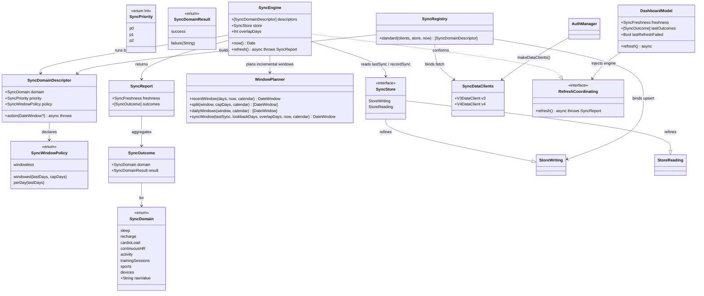

# Epic 5 — Sync Engine (config-driven domain registry, manual refresh, per-day activity, range caps)

> Stack note: Swift 6 / SwiftUI iOS app, SPM modules `PolarProtocol` (clients + auth +
> dashboard seams), `PolarStore` (GRDB store + **the new sync engine**), `HerculesUI`
> (views + view-models). The generic Spring/Java vocabulary of the framework
> (Service/Controller, `GlobalExceptionHandler`, `@RestControllerAdvice`, `ResponseEntity`)
> is adapted to Swift: the orchestrator is a `RefreshCoordinating` conformer, error
> handling is per-domain isolation producing a typed `SyncOutcome` (no global handler, no
> exceptions thrown across the whole refresh), and "DI" is initializer injection at the app
> composition root. There is no HTTP server in this epic — it *consumes* the existing
> v3/v4 HTTP clients.

## Requirements

Turn the dashboard's pull-to-refresh into a real, config-driven sync: one tap fetches every
domain from the Polar v3/v4 clients, persists each through the Epic 4 store, records
freshness, and reports per-domain success/failure — without one domain's failure aborting
the rest, and without unbounded memory on the heavy activity path.

- **Drive sync from config** — a single declarative registry holds each domain's priority,
  fetch window, and API range cap, so changing a window is a one-line edit (HERC-050).
- **Orchestrate one-tap refresh** — run all domains by priority, upsert each via
  `StoreWriting`, update `sync_state`, and surface a per-domain outcome; partial failure is
  isolated (HERC-051).
- **Loop activity per day** — the activity domain iterates day-by-day across its window,
  letting each day's samples downsample and persist before the next fetch (HERC-052).
- **Guard range caps** — clamp each *windowed* domain's request to the API max and page
  oversized ranges into valid sub-requests; overlaps are safe (idempotent upserts) (HERC-053).
- **Sync incrementally** — a domain's first sync pulls the full lookback (capturing existing
  history); every later sync pulls only `[lastSync − overlap, now]`, so routine refreshes stay
  cheap. Anchored on the existing `lastSync(domain:)` Date; the overlap re-pulls recent days
  for server-side corrections (HERC-054).

Boundary: this epic owns *orchestration only*. It adds no decoding (clients do that), no SQL
(the store does that), and no new screens (Epic 6). It conforms to the existing
`RefreshCoordinating` seam so the dashboard wiring is an injection swap. Manual refresh is the
only trigger; background refresh stays deferred (HERC-103).

## Entities

> Conservative-design notes:
> - **No client or store API changes** beyond (a) marking `StoreWriting`/`StoreReading` as
>   `Sendable` and (b) adding a `SyncStore` protocol that simply refines both (so the engine
>   can both `recordSync` and read `lastSync`). The v3/v4 clients, records, and existing
>   read/write methods are reused as-is — incremental sync reuses the existing
>   `lastSync(domain:)` read, no new store method.
> - **`RefreshCoordinating.refresh()` return type changes** `SyncFreshness → SyncReport`
>   (which *contains* `SyncFreshness`) to carry per-domain outcomes. Only two conformers
>   exist (`StubRefreshCoordinator`, the new `SyncEngine`) and one caller (`DashboardModel`)
>   — all updated. `SyncFreshness` itself is unchanged.
> - **`SyncDomain`/`SyncOutcome`/`SyncReport` live in `PolarProtocol`** (the shared seam)
>   so both the engine (`PolarStore`) and `DashboardModel` (`HerculesUI`) can reference them
>   without `HerculesUI` depending on `PolarStore`.

## Approach

1. **Engine placement & module boundary**
   - The concrete `SyncEngine` lives in **`PolarStore`** (a new `Sync/` area) because it
     needs both the clients (`PolarProtocol`) and `StoreWriting` (`PolarStore`); `HerculesUI`
     sees only the `RefreshCoordinating` protocol. The app composition root injects the
     engine into `DashboardModel`. No fourth module.
   - Shared value types the protocol/UI touch (`SyncDomain`, `SyncOutcome`, `SyncReport`)
     go in `PolarProtocol`; the orchestration machinery (`SyncEngine`, `SyncRegistry`,
     `SyncDomainDescriptor`, `SyncWindowPolicy`, `WindowPlanner`) stays in `PolarStore`.

2. **Config-driven registry (HERC-050)**
   - One `SyncDomainDescriptor` per metric, holding identity + `SyncPriority` +
     `SyncWindowPolicy` (windowless / windowed(lastDays,capDays) / perDay(lastDays)) + a
     `@Sendable (DateWindow?) async throws -> Void` action that closes over the right client
     call and `upsert…`. `SyncRegistry.standard(clients:store:now:)` is the **single place**
     windows/priorities/caps are written as literals — "change a window in one line."
   - The orchestrator stays generic; heterogeneity (windowless vs windowed vs per-day) is
     expressed by the policy, not by special-casing in the engine.

3. **Orchestration & error isolation (HERC-051)**
   - `SyncEngine.refresh()` sorts descriptors by priority and runs them **sequentially**
     (avoids API hammering and v4 refresh-token races; makes progress/isolation trivial).
   - For each descriptor the engine derives the invocation list from the policy
     (`[nil]` for windowless; capped sub-windows for windowed; per-day windows for perDay),
     runs each invocation in its own `do/catch`, **continues on failure**, and aggregates a
     `SyncOutcome` (`.success` only if every invocation succeeded). On full-domain success it
     calls `store.recordSync(domain:window:)`. The refresh returns a `SyncReport`
     (aggregate `SyncFreshness` + all outcomes) and **does not throw** on partial failure.
   - Error handling is Swift-idiomatic: client errors (`AuthError`, redaction-safe) are
     caught per invocation and reduced to a short `SyncDomainResult.failure(String)` — no
     global handler, no thrown error escaping the whole refresh, no half-written domain
     (each `upsert…` is already its own transaction).

4. **Per-day activity loop (HERC-052)**
   - The activity descriptor uses `.perDay(lastDays:)`. The engine enumerates the day windows
     **of the effective (incremental) window** and feeds them one single-day `DateWindow` at a
     time; the action fetches that day's totals + samples, then upserts — so each day
     downsamples (already client-side) and persists before the next fetch, bounding peak
     memory. The first sync loops the full lookback; later syncs loop only the recent days
     (HERC-054). A single bad day is caught and the loop continues.

5. **Range-cap splitter (HERC-053)**
   - `WindowPlanner` is a pure, unit-tested helper: `recentWindow(days:now:calendar:)` builds
     the full window from "now"; `syncWindow(...)` narrows it to the incremental window when a
     prior sync exists (item 6); `split(_:capDays:calendar:)` pages an over-cap window into
     consecutive ≤cap sub-windows; `dailyWindows(_:calendar:)` enumerates per-day windows.
     The cap split applies to the **windowed** domains only (continuous-HR cap 30 d, activity
     & training-sessions cap 90 d); windowless domains (sleep/recharge/cardio/sports/devices)
     pass `nil` and are server-bounded. Overlap at chunk boundaries is harmless — upserts
     dedup.

6. **Incremental sync (HERC-054)**
   - For windowed and per-day domains the engine computes the effective window via
     `WindowPlanner.syncWindow(lastSync:lookbackDays:overlapDays:now:)`: if
     `store.lastSync(domain:)` is `nil` (never synced) it returns the **full lookback** —
     the first-sync backfill that captures existing history; otherwise it returns
     `[lastSync − overlapDays, now]` — only the days changed since the last *successful* sync.
   - Anchored on the existing `lastSync(domain:) -> Date?` read (no `last_window` parsing, no
     schema change). `overlapDays` (≈2) re-pulls the most recent days so server-side
     corrections to recent data are picked up; the idempotent store absorbs the overlap.
     Windowless domains ignore this (their set is server-fixed) and always fetch.
   - This makes the first refresh do the heavy backfill (e.g. activity loops ~`lookbackDays`
     days) and every later refresh cheap (loops only the overlap+elapsed days).

7. **Client provisioning & composition**
   - `AuthManager` gains `makeDataClients() -> SyncDataClients`, building `V3DataClient` /
     `V4DataClient` from its already-resolved token store + oauth + v4 config (the store is
     private, so this seam keeps auth encapsulated). The app composition root builds the
     engine from these clients + the on-disk store (typed as `SyncStore`) and injects it.

## Structure

### Inheritance / Conformance Relationships
1. `SyncEngine` conforms to `RefreshCoordinating` (PolarProtocol), whose `refresh()` now
   returns `SyncReport`.
2. `SyncPriority` conforms to `Comparable` (raw `Int`) for priority ordering;
   `SyncOutcome`, `SyncReport`, `SyncDomainResult`, `SyncDomain` conform to
   `Sendable`/`Equatable`.
3. `StoreWriting` and `StoreReading` gain a `Sendable` refinement; a new `SyncStore`
   protocol refines both (`StoreWriting, StoreReading, Sendable`) and `PolarDatabase`
   conforms to it. The `Sendable` `SyncEngine` holds `any SyncStore` so it can both
   `recordSync` (write) and read `lastSync` (read).
4. `SyncDataClients` is a `Sendable` value bundle of the two clients.

### Dependencies
1. `SyncEngine` depends on `[SyncDomainDescriptor]`, `any SyncStore` (for `recordSync` +
   `lastSync`), a `@Sendable () -> Date` clock, an `overlapDays` constant, and `WindowPlanner`
   (static). It does **not** import the network or GRDB directly.
2. `SyncRegistry.standard` depends on `SyncDataClients` (PolarProtocol clients) and
   `any StoreWriting` (PolarStore) — the only place the two are bound together.
3. `AuthManager.makeDataClients()` depends on its existing `store`/`oauth`/`v4Config`.
4. `DashboardModel` depends on `any RefreshCoordinating` (injected engine) — never on
   `PolarStore`.
5. App composition root depends on everything: `AuthManager`, `PolarDatabase`,
   `SyncRegistry`, `SyncEngine`, `DashboardModel`.

### Layered Architecture
1. **Seam layer (`PolarProtocol`):** `RefreshCoordinating` (+`SyncReport`/`SyncOutcome`/
   `SyncDomain`), `SyncDataClients`, `AuthManager.makeDataClients()`. The contracts the UI
   and engine share.
2. **Orchestration layer (`PolarStore/Sync/`):** `SyncEngine`, `SyncRegistry`,
   `SyncDomainDescriptor`, `SyncWindowPolicy`, `WindowPlanner` — pure coordination over
   clients + store.
3. **Client layer (`PolarProtocol`, unchanged):** `V3DataClient`/`V4DataClient` (fetch).
4. **Store layer (`PolarStore`, unchanged save for `Sendable`):** `StoreWriting` upserts +
   `recordSync`.
5. **View-model layer (`HerculesUI`):** `DashboardModel` consumes the `SyncReport`.
6. **Composition root (`App`):** builds + injects the engine.

## Operations

### Create Value Types — `SyncDomain`, `SyncPriority`, `SyncDomainResult`, `SyncOutcome`, `SyncReport` (PolarProtocol)
1. Responsibility: the shared sync vocabulary referenced by the protocol, engine, and UI.
2. Definitions:
   - `public enum SyncDomain: String, Sendable, CaseIterable, Equatable` — cases `sleep`,
     `recharge`, `cardioLoad`, `continuousHR`, `activity`, `trainingSessions`, `sports`,
     `devices`. The `rawValue` is the `sync_state.domain` key.
   - `public enum SyncPriority: Int, Sendable, Comparable { case p0, p1, p2 }` with
     `static func < (lhs, rhs) -> Bool { lhs.rawValue < rhs.rawValue }`.
   - `public enum SyncDomainResult: Sendable, Equatable { case success; case failure(String) }`.
   - `public struct SyncOutcome: Sendable, Equatable { public let domain: SyncDomain; public let result: SyncDomainResult }`.
   - `public struct SyncReport: Sendable, Equatable { public let freshness: SyncFreshness; public let outcomes: [SyncOutcome] }`.
3. Constraints: `failure` messages are redaction-safe (no tokens / raw payloads).

### Update Protocol — `RefreshCoordinating` + `StubRefreshCoordinator` (PolarProtocol)
1. Change `func refresh() async throws -> SyncFreshness` → `-> SyncReport`.
2. `StubRefreshCoordinator.refresh()` returns `SyncReport(freshness: .syncedAt(Date()), outcomes: [])`
   after its existing short delay (keep the no-network stub for previews/tests).
3. Constraints: signature is the only change; doc comment notes the engine is the real
   conformer.

### Create Bundle + Provisioning — `SyncDataClients` + `AuthManager.makeDataClients()` (PolarProtocol)
1. `public struct SyncDataClients: Sendable { public let v3: V3DataClient; public let v4: V4DataClient; public init(v3:v4:) }`.
2. Add to `AuthManager`: `public func makeDataClients() -> SyncDataClients`
   - Logic: `V3DataClient(transport: V3Transport(store: store))`;
     `V4DataClient(transport: RefreshAwareV4Client(store: store, oauth: oauth, config: v4Config))`;
     return the bundle.
   - Rationale: `store` is private; this keeps the token store / config encapsulated while
     vending authenticated clients. Transports read the live token store dynamically, so the
     bundle stays valid across refreshes / re-auth.

### Update Protocols — `StoreWriting` / `StoreReading` add `Sendable`; add `SyncStore` (PolarStore)
1. Change to `public protocol StoreWriting: Sendable` and `public protocol StoreReading: Sendable`.
2. Add `public protocol SyncStore: StoreWriting, StoreReading {}` and
   `extension PolarDatabase: SyncStore {}` (empty — it already conforms to both).
3. Constraint: `PolarDatabase` is already `Sendable` and already implements both protocols, so
   no behavioural change; this only lets the engine hold one `any SyncStore` that can both
   `recordSync` (write) and `lastSync` (read) for incremental windowing.

### Create Helper — `WindowPlanner` (PolarStore/Sync)
1. Responsibility: pure window math for the registry/engine; no I/O, no shared state.
2. Methods (all `static`):
   - `recentWindow(days: Int, now: Date, calendar: Calendar = .current) -> DateWindow`
     - Logic: `to = now`; `from = startOfDay(now) - (days - 1) days` via `calendar`; return
       `DateWindow(from:to:)`. `days <= 0` clamps to a single-day window.
   - `split(_ window: DateWindow, capDays: Int, calendar: Calendar = .current) -> [DateWindow]`
     - Logic: if the window spans `<= capDays` days, return `[window]`; else walk from
       `window.from` in `capDays` strides producing consecutive sub-windows, the last
       clamped to `window.to`. No gaps; adjacent/overlap at boundaries is acceptable.
   - `dailyWindows(_ window: DateWindow, calendar: Calendar = .current) -> [DateWindow]`
     - Logic: one `DateWindow` per calendar day in `[from, to]`, each `[startOfDay(d), startOfDay(d)+1day)`.
   - `syncWindow(lastSync: Date?, lookbackDays: Int, overlapDays: Int, now: Date, calendar: Calendar = .current) -> DateWindow`
     - Logic (HERC-054): if `lastSync == nil`, return `recentWindow(days: lookbackDays, now: now, calendar:)`
       (full first-sync backfill); else return `DateWindow(from: startOfDay(lastSync) − overlapDays days, to: now)`.
       Clamp `from` to not precede `recentWindow(lookbackDays).from` (never older than the
       configured lookback). `overlapDays <= 0` means "since lastSync, no buffer".
3. Constraints: deterministic given `lastSync`+`now`+`calendar`; covered by unit tests
   (boundary counts, cap splitting, day enumeration, first-sync vs incremental window).

### Create Config — `SyncWindowPolicy` + `SyncDomainDescriptor` (PolarStore/Sync)
1. `enum SyncWindowPolicy: Sendable { case windowless; case windowed(lastDays: Int, capDays: Int); case perDay(lastDays: Int) }`.
2. `struct SyncDomainDescriptor: Sendable { let domain: SyncDomain; let priority: SyncPriority; let policy: SyncWindowPolicy; let action: @Sendable (DateWindow?) async throws -> Void }`.
3. Constraints: the descriptor carries no client/store reference itself — those are captured
   in `action` by the registry.

### Create Registry — `SyncRegistry.standard(clients:store:now:)` (PolarStore/Sync)
1. Responsibility: the **one-line-edit** config — bind each `SyncDomain` to its client call,
   `upsert…`, priority, policy, and caps.
2. Signature: `static func standard(clients: SyncDataClients, store: any StoreWriting, now: @Sendable () -> Date) -> [SyncDomainDescriptor]`.
3. Descriptors (priority/policy literals here — verified against `ARCHITECTURE.md` §7 caps):
   - `.sleep` · p1 · `.windowless` → `try store.upsertSleep(try await clients.v3.fetchSleep())`
   - `.recharge` · p1 · `.windowless` → `upsertRecharge(fetchNightlyRecharge())`
   - `.cardioLoad` · p1 · `.windowless` → `upsertCardioLoad(fetchCardioLoad())`
   - `.continuousHR` · p1 · `.windowed(lastDays: 40, capDays: 30)` → guard window; `upsertHeartRateMinutes(fetchContinuousHeartRate(window))`
   - `.activity` · p1 · `.perDay(lastDays: 40)` → guard window; `let date = window.from`;
     `let day = fetchDailyActivity(date: date)`; `let s = fetchActivitySamples(date: date)`;
     `upsertActivity(day: day, zones: s.zones)`; `upsertActivityMinutes(s.steps)`
   - `.trainingSessions` · p1 · `.windowed(lastDays: 90, capDays: 90)` → guard window; `upsertTrainingSessions(fetchTrainingSessions(window))`

   > **Lookback rationale.** `lastDays` is the **first-sync lookback** (the backfill window),
   > sized to cover the current account's full history (~1 month, started 2026-05-28). The
   > *first* refresh of each domain pulls this full window; *every later* refresh pulls only
   > the incremental `[lastSync − overlap, now]` window (HERC-054), so routine refreshes stay
   > cheap (the activity per-day loop shrinks from ~`lastDays` days to just the recent days).
   > `continuousHR`'s 40 d > its 30 d cap, so on the first sync the splitter pages it into two
   > sub-requests. Windowless domains (sleep/recharge/cardio) are server-bounded to ~28 days
   > and cannot reach earlier history regardless of lookback.
   - `.sports` · p2 · `.windowless` → `upsertSports(fetchSports())`
   - `.devices` · p2 · `.windowless` → `upsertDevice` for each / first device (`fetchDevices()` returns `[Device]`; upsert each)
4. Constraints: windowless actions ignore the `DateWindow?` (it is `nil`); the `now` clock is
   used by the engine for window planning, not inside the actions.

### Implement Orchestrator — `SyncEngine: RefreshCoordinating` (PolarStore/Sync)
1. Stored: `let descriptors: [SyncDomainDescriptor]`, `let store: any SyncStore`,
   `let now: @Sendable () -> Date`, `let overlapDays: Int` (default 2).
   `public init(descriptors:store:now:overlapDays:)`.
2. `public func refresh() async throws -> SyncReport`
   - Sort `descriptors` by `priority` (ascending).
   - For each descriptor: read `let last = try? store.lastSync(domain: domain.rawValue)`,
     then build the invocation windows from `policy` (HERC-054 — incremental windowing):
     - `windowless → [nil]`
     - `windowed(d, cap) → let w = WindowPlanner.syncWindow(lastSync: last, lookbackDays: d, overlapDays: overlapDays, now: now()); WindowPlanner.split(w, capDays: cap).map(Optional.some)`
     - `perDay(d) → let w = WindowPlanner.syncWindow(lastSync: last, lookbackDays: d, overlapDays: overlapDays, now: now()); WindowPlanner.dailyWindows(w).map(Optional.some)`
   - Run invocations sequentially, each in `do { try await descriptor.action(w) } catch { record first error; continue }`.
   - If no invocation failed: append `SyncOutcome(domain, .success)`, set `anySuccess = true`,
     and `try? store.recordSync(domain: domain.rawValue, window: windowLabel)` (updates the
     `lastSync` anchor for the next refresh). Else append `SyncOutcome(domain, .failure(shortMessage))`
     and **do not** `recordSync` — the anchor stays at the last *successful* sync so the next
     refresh re-pulls from there (no gap).
   - `windowLabel`: `"windowless"`, or `"<from>..<to>"` (ISO date) for windowed/per-day.
   - Return `SyncReport(freshness: anySuccess ? .syncedAt(now()) : .neverSynced, outcomes:)`.
     Never throws on partial/total failure — failures live in `outcomes`.
3. Dependency injection: constructor-injected descriptors/store/clock/overlap.
4. Transaction management: none in the engine — each `upsert…`/`recordSync` is its own
   store transaction (HERC-041). The engine only sequences them.

### Wire Composition Root — `App/HerculesApp.swift`
1. Build order in `init()`: create `AuthManager.live()`; open `PolarDatabase.onDisk()`
   (already present, conforms to `SyncStore`); if the store opened, `let clients = auth.makeDataClients()`,
   `let engine = SyncEngine(descriptors: SyncRegistry.standard(clients: clients, store: store, now: { Date() }), store: store, now: { Date() })`
   (the same `store` instance is passed to the registry as the `StoreWriting` for upserts and
   to the engine as the `SyncStore` for `lastSync`/`recordSync`; `overlapDays` uses its default),
   and initialize `DashboardModel(coordinator: engine)`; else fall back to the default
   stub-backed `DashboardModel()`.
2. Constraints: provider stays `StubDashboardProvider` (store-backed reads are Epic 6); only
   the coordinator is swapped. Assign `@State` via `_auth`/`_dashboard = State(initialValue:)`.

### Update View-Model — `DashboardModel.refresh()` (HerculesUI)
1. Add `public private(set) var lastOutcomes: [SyncOutcome] = []`.
2. `refresh()`: keep the re-entrancy guard; `let report = try await coordinator.refresh()`;
   set `lastOutcomes = report.outcomes`; if `case .syncedAt = report.freshness { freshness = report.freshness }`
   (else keep prior); `lastRefreshFailed = report.outcomes.contains { if case .failure = $0.result { return true }; return false }`.
   On a thrown error (total transport failure), set `lastRefreshFailed = true` and keep prior
   freshness. Then re-pull `cards = await provider.snapshot().cards`.
3. Constraints: no SwiftUI import; no banner this slice (outcomes exposed for Epic 6 to render).

## Norms

1. **Module placement:** shared sync value types in `PolarProtocol`; orchestration machinery
   in `PolarStore/Sync/`; `HerculesUI` depends only on the `RefreshCoordinating` protocol.
   Never import `PolarStore` from `HerculesUI`.
2. **Config in one place:** all per-domain windows/priorities/caps are literals inside
   `SyncRegistry.standard`. No window/priority constants scattered across the engine or
   clients.
3. **Concurrency:** the engine is `Sendable`; descriptor actions are `@Sendable`; the clock is
   `@Sendable () -> Date`. Domains run sequentially by priority — no `TaskGroup` this slice.
4. **Error handling (Swift-idiomatic):** client errors (`AuthError`, redaction-safe) are
   caught per invocation and reduced to `SyncDomainResult.failure(String)`. `refresh()` does
   not propagate partial failure as a thrown error. No `GlobalExceptionHandler` equivalent;
   isolation is structural (per-domain `do/catch`). Messages never contain tokens/payloads.
5. **Idempotency reliance:** the engine re-pulls overlapping windows freely; correctness comes
   from the store's natural-key upserts, not from engine-side dedup.
6. **Incremental anchoring (HERC-054):** the per-domain fetch window is derived from
   `store.lastSync(domain:)` via `WindowPlanner.syncWindow` — full lookback on first sync,
   `[lastSync − overlapDays, now]` thereafter. `recordSync` runs only on success, so a failed
   domain keeps its anchor. Windowless domains are exempt (server-fixed set).
7. **Purity of window math:** `WindowPlanner` is pure and deterministic given
   `lastSync`+`now`+`calendar`; all date arithmetic for fetch windows goes through it.
8. **Reuse, don't fork:** use the existing `V3DataClient`/`V4DataClient`, `DateWindow`,
   `StoreWriting`/`StoreReading` (incl. the existing `lastSync`), and `recordSync` as-is; add
   no parallel fetch/persist paths and no new store read for incremental.
9. **Documentation:** each descriptor/registry entry cites its endpoint + cap (`ARCHITECTURE.md`
   §7); the engine cites the HERC-051 isolation rule. Match the existing comment density.

## Safeguards

1. **Functional — one-tap, config-driven (HERC-050/051):** a single `refresh()` runs all
   eight domains; changing a fetch window is a one-line edit in `SyncRegistry.standard`. The
   engine reads windows/priorities/caps only from the registry.
2. **Partial-failure isolation (HERC-051):** one domain throwing must not stop the others;
   `refresh()` returns a `SyncReport` whose `outcomes` mark each domain success/failure, and
   `recordSync` is called only for fully-successful domains. Proven by an engine test with a
   deliberately failing descriptor among succeeding ones.
3. **Bounded memory on activity (HERC-052):** the activity domain is `.perDay`; each day is
   fetched → downsampled (client-side) → upserted before the next day. No accumulation of all
   days in memory. Proven by a multi-day per-day test asserting per-day write/release ordering.
4. **Range-cap correctness (HERC-053):** windowed requests are split to ≤ cap
   (continuous-HR 30 d; activity/sessions 90 d); `WindowPlanner.split` produces gap-free
   sub-windows. Windowless domains pass `nil` and are out of scope (server-bounded). Proven by
   `WindowPlanner` unit tests (a >cap window splits into the expected sub-window count/bounds).
5. **Idempotent re-sync:** running `refresh()` twice yields identical store row counts (relies
   on Epic 4 upserts). No engine-side dedup. Overlap from paging *and* the incremental buffer
   is harmless.
6. **Incremental correctness (HERC-054):** a domain's first sync pulls the full lookback; a
   refresh shortly after a successful one fetches only `[lastSync − overlapDays, now]` (few
   round-trips), and the resulting data is identical to a full re-pull. A failed domain does
   not advance its anchor. Proven by a test that seeds `lastSync` via `recordSync`, then
   asserts the engine's computed window/day-count is the small incremental window — and that a
   never-synced domain gets the full lookback.
7. **Trigger constraint:** manual refresh is the only network entry point (Safeguard 5);
   no timers, no background tasks in this epic.
8. **Error-handling constraints:** `SyncDomainResult.failure` messages are redaction-safe;
   a torn-down/expired credential surfaces as a clean per-domain failure (and, via the v4
   transport, `AuthError.refreshFailed`), never a crash or a half-written domain.
9. **Boundary constraints:** the engine adds no decoding and no SQL; it imports neither
   `URLSession` nor `GRDB` directly. `HerculesUI` gains no `PolarStore` dependency. Store-API
   changes are additive only — the `Sendable` refinement plus the empty `SyncStore` protocol;
   no schema migration (`sync_state` already exists; no error column added — per-domain status
   is in-memory only) and no new store read (incremental reuses `lastSync`).
10. **Determinism for tests:** the injected `now` clock makes window planning and freshness
   deterministic; the engine is unit-testable with hand-built descriptors over an in-memory
   `PolarDatabase`, no network required.
