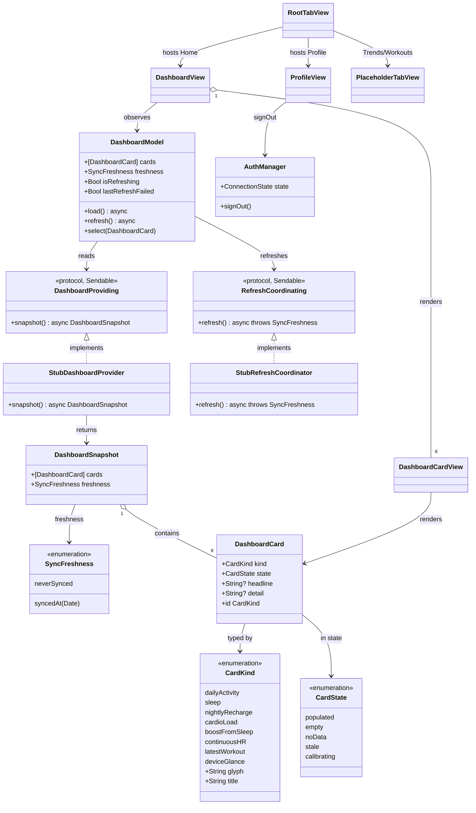

# Dashboard Shell & Navigation Scaffold (HERC-065)

## Requirements

- Stand up a **basic, working dashboard** that connected users land on, replacing the `HerculesRootView` placeholder as the `connected` route — built entirely in the Hercules instrument design language.
- Establish the **navigation shell**: a bottom tab bar (`Home · Trends · Workouts · Profile`) with Home = the dashboard feed; Trends/Workouts as labelled placeholders; Profile hosting **sign-out / disconnect** (`AuthManager.signOut()`).
- Render the **home feed of all 8 metric cards** (Daily Activity, Sleep, Nightly Recharge, Cardio Load, Boost from Sleep, Continuous HR, Latest Workout, Device) as **empty / first-run shells** — the empty state is the *primary* visual this slice, since no data layer exists yet.
- Introduce two **stubbed seams** so real data and sync drop in later without restructuring: a `DashboardProviding` data seam (returns empty cards + "never synced" freshness) and a `RefreshCoordinating` seam wired to **pull-to-refresh** (no network).
- **Boundary:** presentation-only; **no `PolarStore` schema migration**, no v3/v4 data fetching, no detail screens. Cards are **non-interactive** (a routing seam is stubbed for when detail screens land). Drag-to-reorder is deferred.
- **Value:** gives the app a real, navigable home immediately and a clean extension point — each future feature (EPIC 2–6) plugs one populated card into the feed behind a stable contract.

## Entities

**Conservative notes:** reuse the existing `Theme` tokens and the presentation-only view convention from `HerculesUI/Onboarding/`; do **not** modify `PolarDatabase`, `PolarStore`, or any auth type. `DashboardCard` carries optional `headline`/`detail` strings (nil now) so future populated cards need no new per-domain types in this slice — avoid premature per-domain glance structs.

## Approach

1. **Module placement (respect existing dependency directions):**
   - **Contracts + value types + stubs in `PolarProtocol`** (`Dashboard/`): `CardKind`, `CardState`, `SyncFreshness`, `DashboardCard`, `DashboardSnapshot`, `DashboardProviding` + `StubDashboardProvider`, `RefreshCoordinating` + `StubRefreshCoordinator`. Reason: `HerculesUI` and (later) `PolarStore` both depend on `PolarProtocol`, but `PolarStore` cannot import `HerculesUI` — so the seam a `PolarStore`-backed provider will implement must live in `PolarProtocol`. This mirrors `InitialSyncProviding`/`StubInitialSyncProvider` from the auth slice.
   - **View-model + views in `HerculesUI`** (`Dashboard/`): `DashboardModel` (`@MainActor @Observable`), `RootTabView`, `DashboardView`, `DashboardCardView`, `ProfileView`, `PlaceholderTabView`. Presentation-only, observing the model.

2. **Data-driven feed for incremental growth:**
   - The feed is `[DashboardCard]` in the fixed design order; `DashboardView` renders each via a single `DashboardCardView` that switches on `CardState`. Adding a future feature = the provider emits a `populated` card for that `CardKind` (and later a detail route) — no change to the feed plumbing. Drag-to-reorder (design frame 03) is deferred.

3. **Stubbed seams, swappable later:**
   - `StubDashboardProvider.snapshot()` returns all 8 cards in `.empty` state + `freshness = .neverSynced`. Local-first: `snapshot()` is non-throwing and returns instantly (reads from local store in the real impl; empty when no data).
   - `StubRefreshCoordinator.refresh()` performs **no network**, awaits a short delay to animate the affordance, and returns `.syncedAt(Date())`. `refresh()` is `throws` to model the future partial-failure path (HERC-051) even though the stub never fails.

4. **View-model orchestration (mirror `AuthManager`):**
   - `DashboardModel` is `@MainActor @Observable`, injects `any DashboardProviding` + `any RefreshCoordinating` via initializer with **stub defaults**, and exposes `private(set)` state (`cards`, `freshness`, `isRefreshing`, `lastRefreshFailed`).
   - `load()` pulls a snapshot on appear; `refresh()` toggles `isRefreshing`, calls the coordinator, updates `freshness`, re-pulls the snapshot, and records `lastRefreshFailed` on a thrown error (kept non-fatal, no banner required this slice).

5. **Navigation shell & routing seam:**
   - `RootTabView` is a `TabView` tinted with `Theme.accent`: Home → `DashboardView`; Trends/Workouts → `PlaceholderTabView`; Profile → `ProfileView`.
   - Cards are **non-interactive** this slice; `DashboardModel.select(_:)` is the documented routing seam (no-op now), to be wired to detail navigation when those screens exist.

6. **App-root wiring:**
   - `HerculesApp` owns a `DashboardModel` (`@State`, stub-backed) alongside the existing `AuthManager`; the `connected` branch renders `RootTabView(auth:dashboard:)` instead of `HerculesRootView`. `bootstrap()`/onboarding routing is unchanged.

7. **Error & empty handling (Swift idiom, not a Spring advice):**
   - No exceptions surface into the view layer. Absence of data is a first-class `CardState` (`.empty`/`.noData`), not an error. A failed stub refresh sets `lastRefreshFailed` and leaves the prior freshness intact; cards never show a spinner (the refresh affordance is the system pull-to-refresh control).

## Structure

### Type / Protocol Relationships
1. `DashboardProviding` protocol (`Sendable`) defines `snapshot()`; `StubDashboardProvider` is the concrete value implementation (real `PolarStore`-backed provider lands with HERC-042).
2. `RefreshCoordinating` protocol (`Sendable`) defines `refresh()`; `StubRefreshCoordinator` implements it with no network (real engine: EPIC 5 / HERC-051).
3. `CardKind`, `CardState`, `SyncFreshness` are `Sendable` enums; `CardKind` carries presentation metadata (`glyph`, `title`).
4. `DashboardCard` and `DashboardSnapshot` are `Sendable` value types; `DashboardCard` is `Identifiable` by `CardKind`.
5. `DashboardModel` is `@MainActor @Observable`; views are SwiftUI `View`s observing it.

### Dependencies
1. `DashboardModel` injects `DashboardProviding` + `RefreshCoordinating` (stub defaults).
2. `DashboardView` observes `DashboardModel`; `DashboardCardView` renders a single `DashboardCard`.
3. `RootTabView` injects `AuthManager` (for `ProfileView` sign-out) and `DashboardModel` (for Home).
4. `HerculesApp` owns `AuthManager` + `DashboardModel`; routes `connected → RootTabView`.
5. View layer has **no** network/Keychain/DB access — only the injected protocols and `Theme`.

### Layered Architecture (mapped to existing modules)
1. **App target** (`App/`): root router; owns `AuthManager` + `DashboardModel`; swaps the `connected` route to `RootTabView`.
2. **HerculesUI** (`Dashboard/`): `DashboardModel` view-model + all dashboard/nav/profile views; presentation only; reuses `Theme`.
3. **PolarProtocol** (`Dashboard/`): dashboard contracts (`DashboardProviding`, `RefreshCoordinating`), value types, and stubs — the shared seam `PolarStore` will implement later.
4. **PolarStore**: **unchanged** in this slice (no schema migration); eventual home of the `DashboardProviding` implementation over read APIs.
5. **Cross-cutting:** card-state model is the single place "absence of data" is expressed; no error type crosses into views.

## Operations

> Build order respects dependencies. All types crossing isolation boundaries are `Sendable`; Swift 6 strict concurrency clean. One primary type per file under the owning module.

### Create Enum — CardKind (PolarProtocol/Dashboard)
1. Responsibility: identify each dashboard domain and carry its presentation metadata.
2. Cases (in feed order): `dailyActivity`, `sleep`, `nightlyRecharge`, `cardioLoad`, `boostFromSleep`, `continuousHR`, `latestWorkout`, `deviceGlance`. Conform to `String`, `Sendable`, `CaseIterable`, `Identifiable` (`id = self`).
3. Computed: `var glyph: String` → `A/Z/R/C/B/H/W/D`; `var title: String` → `DAILY ACTIVITY`, `SLEEP`, `NIGHTLY RECHARGE`, `CARDIO LOAD`, `BOOST FROM SLEEP`, `CONTINUOUS HR`, `LATEST WORKOUT`, `DEVICE`.
4. Constraint: `CaseIterable` order **is** the default feed order.

### Create Enum — CardState (PolarProtocol/Dashboard)
1. Cases: `populated`, `empty`, `noData`, `stale`, `calibrating`. `Sendable`, `Equatable`.
2. Note: this slice only ever emits `.empty`; the other cases exist so future cards/states need no enum change.

### Create Enum — SyncFreshness (PolarProtocol/Dashboard)
1. Cases: `neverSynced`, `syncedAt(Date)`. `Sendable`, `Equatable`.
2. Constraint: presentation (e.g. "SYNCED 2M AGO") is computed in the view, not stored here.

### Create Model — DashboardCard (PolarProtocol/Dashboard)
1. Attributes: `kind: CardKind`, `state: CardState`, `headline: String?` (nil now), `detail: String?` (nil now). `Sendable`, `Identifiable` (`var id: CardKind { kind }`), `Equatable`.
2. Init: memberwise with `headline`/`detail` defaulting to `nil`.
3. Constraint: do **not** add per-domain fields in this slice; populated rendering arrives with each domain's feature.

### Create Model — DashboardSnapshot (PolarProtocol/Dashboard)
1. Attributes: `cards: [DashboardCard]`, `freshness: SyncFreshness`. `Sendable`.
2. Init: memberwise.

### Create Seam — DashboardProviding + StubDashboardProvider (PolarProtocol/Dashboard)
1. Protocol `DashboardProviding: Sendable` — `func snapshot() async -> DashboardSnapshot`.
2. `StubDashboardProvider: DashboardProviding` (struct, `Sendable`):
   - Logic: return `DashboardSnapshot(cards: CardKind.allCases.map { DashboardCard(kind: $0, state: .empty) }, freshness: .neverSynced)`.
3. Constraint: non-throwing, returns instantly (local-first); no network/DB this slice.

### Create Seam — RefreshCoordinating + StubRefreshCoordinator (PolarProtocol/Dashboard)
1. Protocol `RefreshCoordinating: Sendable` — `func refresh() async throws -> SyncFreshness`.
2. `StubRefreshCoordinator: RefreshCoordinating` (struct, `Sendable`):
   - Logic: `try await Task.sleep(for: .milliseconds(600))`; return `.syncedAt(Date())`. **No network I/O.**
3. Constraint: `throws` reserved for the future engine's partial-failure path; the stub never fails.

### Implement View-Model — DashboardModel (`@MainActor`, `@Observable`) (HerculesUI/Dashboard)
1. Published: `private(set) var cards: [DashboardCard] = []`, `private(set) var freshness: SyncFreshness = .neverSynced`, `private(set) var isRefreshing = false`, `private(set) var lastRefreshFailed = false`.
2. Dependencies: `let provider: any DashboardProviding`, `let coordinator: any RefreshCoordinating`; `init(provider: any DashboardProviding = StubDashboardProvider(), coordinator: any RefreshCoordinating = StubRefreshCoordinator())`.
3. Methods:
   - `func load() async` — `let s = await provider.snapshot(); cards = s.cards; freshness = s.freshness`.
   - `func refresh() async` — guard not already refreshing; `isRefreshing = true`; `defer { isRefreshing = false }`; `do { freshness = try await coordinator.refresh(); lastRefreshFailed = false } catch { lastRefreshFailed = true }`; then re-pull `cards`/`freshness` baseline via `await load()` is unnecessary — instead re-pull cards only: `cards = await provider.snapshot().cards` (keep the just-set freshness).
   - `func select(_ card: DashboardCard)` — **routing seam, no-op this slice**; document: "push detail when detail screens land (EPIC 6/7)".
4. Constraint: no SwiftUI import; mirrors `AuthManager` (MainActor, `@Observable`, injected protocols, stub defaults).

### Create View — DashboardCardView (HerculesUI/Dashboard)
1. Input: `let card: DashboardCard`.
2. Layout: slate card (`Theme.card` fill, `Theme.cardBorder` 1px border, 12pt radius — match `ConsentView` `ScopeRow`): 34pt glyph tile (`card.kind.glyph`, accent on slate) + `card.kind.title` (mono bold, tracked).
3. State body (switch `card.state`): `.empty`/`.noData` → muted `—` hero + `NO DATA YET` sublabel (`Theme.muted`/`Theme.faint`); other cases render `card.headline`/`card.detail` when present (future). 
4. Constraint: **non-interactive** (no `Button`/tap gesture this slice); presentation only.

### Create View — DashboardView (HerculesUI/Dashboard)
1. Input: `let model: DashboardModel` (or `@Bindable`).
2. Layout: header (`TODAY` + current date `WED · 26 JUN` style + freshness label + `PULL TO SYNC` hint) above a `ScrollView`/`LazyVStack` of `DashboardCardView` over `model.cards`.
3. Behavior: `.refreshable { await model.refresh() }` (the only sync trigger); `.task { await model.load() }` on appear.
4. Freshness label: `neverSynced → "NEVER SYNCED"`; `syncedAt(d) → "SYNCED \(relative) AGO"` (or `"SYNCED JUST NOW"` under ~a minute) via `RelativeDateTimeFormatter`.
5. Constraint: pure black canvas; reserve orange for active accents; no circular spinners (system pull-to-refresh only).

### Create View — PlaceholderTabView (HerculesUI/Dashboard)
1. Input: `let title: String`.
2. Layout: centered instrument-styled empty state — title (tracked mono) + `COMING SOON` sublabel on black.

### Create View — ProfileView (HerculesUI/Dashboard)
1. Input: `let auth: AuthManager`.
2. Layout: connection status row (`CONNECTED`, accent) + a destructive **DISCONNECT** pill that calls `auth.signOut()`.
3. Constraint: the only place sign-out lives; routes back to onboarding via `AuthManager` (`connected → disconnected`).

### Create View — RootTabView (HerculesUI/Dashboard)
1. Input: `let auth: AuthManager`, `let dashboard: DashboardModel`.
2. Layout: `TabView` tinted `Theme.accent` with four tabs — Home (`DashboardView(model: dashboard)`), Trends (`PlaceholderTabView("TRENDS")`), Workouts (`PlaceholderTabView("WORKOUTS")`), Profile (`ProfileView(auth: auth)`). Tab labels per design (`HOME · TRENDS · WORKOUTS · PROFILE`).
3. Constraint: public entry point HerculesUI exposes for the app router.

### Wire — App root router (App/HerculesApp.swift)
1. Add `@State private var dashboard = DashboardModel()` alongside the existing `@State private var auth`.
2. In the `connected` case, render `RootTabView(auth: auth, dashboard: dashboard)` in place of `HerculesRootView()`. Leave onboarding routing, `bootstrap()`, and `.onOpenURL` unchanged.

## Norms

1. **Concurrency:** async/await throughout; seam protocols (`DashboardProviding`, `RefreshCoordinating`) and all value types are `Sendable`; `DashboardModel` and all views are `@MainActor`. Stubs are `Sendable` value types. Match the auth layer's model exactly.
2. **Dependency injection:** protocol-based seams injected via initializer with **stub live defaults** (`StubDashboardProvider`, `StubRefreshCoordinator`); enables swapping a `PolarStore`-backed provider and the real sync engine without touching views.
3. **Presentation purity:** views import only `SwiftUI` + `PolarProtocol`; **no** `URLSession`, `Keychain`, GRDB, or `PolarStore` references in the view layer. All display data flows from the observed `DashboardModel`.
4. **Design system:** use `Theme` tokens (palette + `Theme.mono`); pure-black canvas; orange reserved for active/important; slate cards with hairline borders; **no circular spinners** — pull-to-refresh is the only loading affordance on the dashboard. Match the existing onboarding views' styling idioms.
5. **Absence-as-state:** missing data is a `CardState` (`.empty`/`.noData`), never an error or a crash; the empty state is fully designed, not a blank.
6. **Naming/files:** one primary type per file; dashboard contracts/stubs under `PolarProtocol/Dashboard/`, view-model + views under `HerculesUI/Dashboard/`; feed order centralized in `CardKind.allCases`.
7. **Logging:** none required in the view layer; if any diagnostic is added it is redaction-safe and outcome-only (consistent with the auth layer's Norm 6).

## Safeguards

1. **Functional constraints:** the `connected` route renders `RootTabView` (not `HerculesRootView`); all 8 cards render the `.empty` state cleanly with no data; the feed order equals `CardKind.allCases`; cards are non-interactive this slice.
2. **Performance constraints:** opening the dashboard is instant and never blocks on the network (local-first); `snapshot()` returns synchronously-fast; pull-to-refresh is non-blocking and idempotent (repeated pulls are safe, `isRefreshing` guards re-entrancy).
3. **Security constraints:** no secrets, tokens, network, or Keychain access in the view layer or the dashboard seams; sign-out delegates entirely to `AuthManager.signOut()` (which clears the Keychain).
4. **Integration constraints:** **no `PolarStore` schema migration** and no changes to `PolarDatabase`, auth types, or `project.yml`; reuse `Theme` unchanged; the dashboard seam lives in `PolarProtocol` so a future `PolarStore` provider can conform without a UI dependency.
5. **Business-rule constraints:** pull-to-refresh is the **only** network trigger (a no-op stub here); the dashboard reads only from the provider seam; read-only — nothing is written back to Polar.
6. **Error-handling constraints:** no exceptions cross into views; a failed stub refresh sets `lastRefreshFailed` and preserves the prior freshness; absence of data degrades to `.empty`/`.noData`, never an alarming state.
7. **Technical constraints:** Swift 6 strict-concurrency clean (no data races; `Sendable` across boundaries); `DashboardModel`/views are `@MainActor`; builds for the iOS 26 simulator and device.
8. **Data constraints:** `DashboardCard` carries no per-domain fields yet (`headline`/`detail` optional, nil); `SyncFreshness` distinguishes `neverSynced` from `syncedAt`; freshness display is computed in the view.
9. **Extensibility constraints:** adding a future card is a **localized** change — the provider emits a populated `DashboardCard` for a `CardKind` (and later a route via `select`); the feed/render plumbing and `DashboardView` need no structural change. Drag-to-reorder (design frame 03) is explicitly out of scope.
